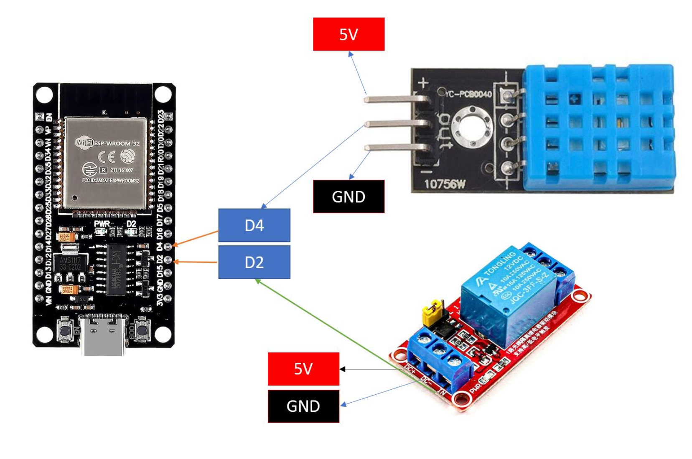
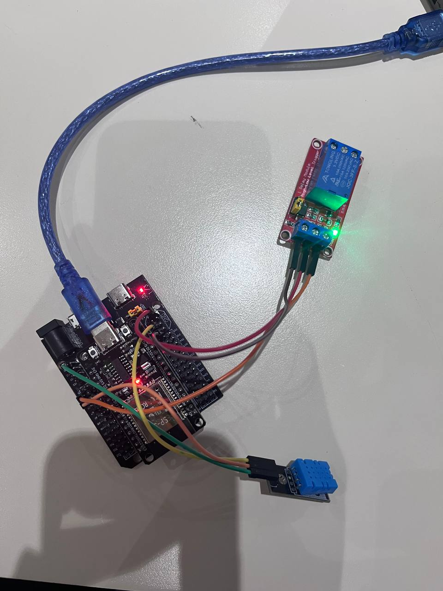
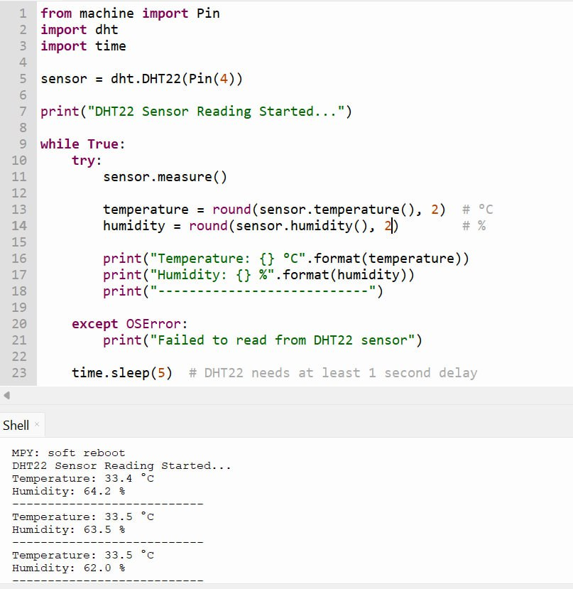
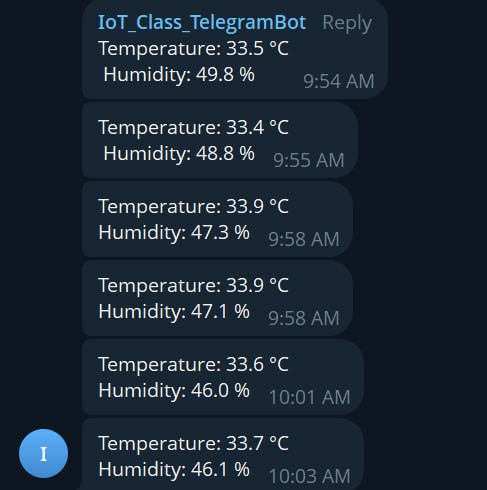
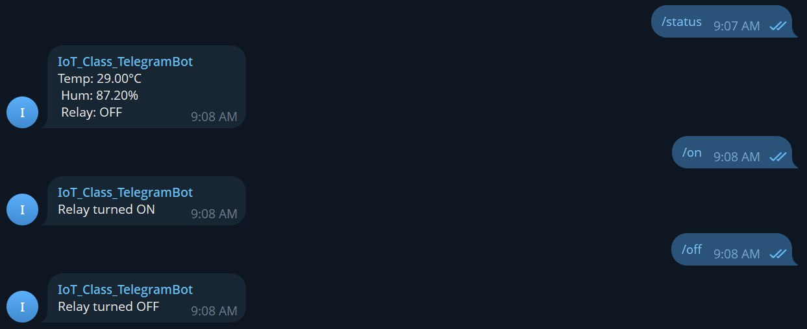

# Lab 1 - Temperature Sensor With Relay Control (Telegram)

## Overview
In this lab, you will build a tiny IoT monitoring node with an ESP32, DHT22 temperature/humidity sensor, and a relay. The ESP32 sends Telegram alerts when the temperature rises above a threshold and lets users control the relay via chat commands. Once the temperature drops below the threshold again, the relay turns off automatically.

## Activity Objective
- Design and implement an IoT system using ESP32 + MicroPython (sensing, actuation, networking).
- Apply programming techniques for periodic sampling, debouncing, and simple state machines.
- Develop a chat-based remote control application using Telegram Bot API (HTTP requests).
- Document and present system design, wiring, and test evidence (screenshots/video), and reflect on reliability/ethics.
- Evaluate performance (sampling interval, rate limits) and safety (relay loads, power isolation).

## Hardware
- Microcontroller with Wi-Fi ESP32, Exstension Board
- DHT22 temperature/humidity sensor
- Relay module
- Jumper wires, breadboard

## Equipment
- ESP32 dev board 
- DHT22 sensor
- Relay module
- Jumper wires
- USB cable + laptop with Thonny
- Wi-Fi access (internet)
- Telegram Bot Token

## Wiring
This is the diagram for wiring setup with the available equipments.






## Configuration
These are the main configuration to run all the tasks in this activity. 

- Wi-Fi SSID and password
- Telegram bot token
- Telegram chat ID (group or user)

```
WIFI_SSID = "YOUR_SSID"
WIFI_PASS = "YOUR_PASSWORD"
BOT_TOKEN = "YOUR_TELEGRAM_BOT_TOKEN"
CHAT_ID = "YOUR_CHAT_ID"
```

## Usage
1. Setup the correct wire and upload the code to Thonny.
2. Open the serial monitor at the configured baud rate.
3. Verify sensor readings every 5 seconds.
4. In Telegram, send commands to the bot:
   - `/status` -> returns temperature, humidity, and relay state
   - `/on` -> turns relay ON
   - `/off` -> turns relay OFF

## Tasks & Checkpoints
### Task 1 - Sensor Read & Print (10 pts)
- Read DHT22 every 5 seconds and print the temperature and humidity with 2 decimals.




### Task 2 - Telegram Send 
- Implement `send_message()` and post a test message to your group.




### Task 3 - Bot Command 
- Implement `/status` to reply with current T/H and relay state.
- Implement `/on` and `/off` to control the relay.



### Task 4 - Bot Command 
- No messages while T < 30 C.
- If T >= 30 C and relay is OFF, send an alert every loop (5 s) until `/on` is received.
- After `/on`, stop alerts. When T < 30 C, turn relay OFF automatically and send a one-time "auto-OFF" notice.
- [Youtube URL Demo](https://youtu.be/9gIZeITX3Lg?si=5_11ZkxCP0XvGIIm)


### Task 5 - Robustness 
- Auto-reconnect Wi-Fi when dropped.
- Handle Telegram HTTP errors (print status; skip this cycle on failure).
- Avoid crashing on DHT OSError (skip cycle).

### Task 6 - Document 
- README.md with wiring diagram/photo, configuration steps (token, chat id), and usage instructions.


