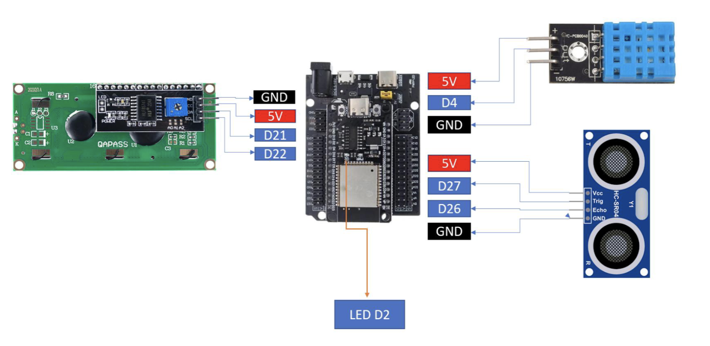
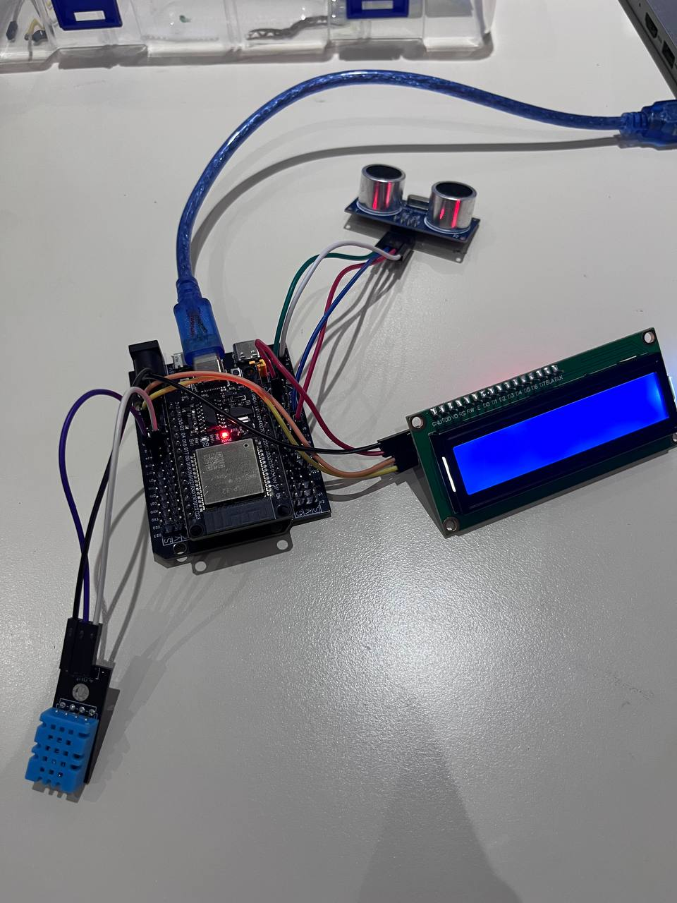
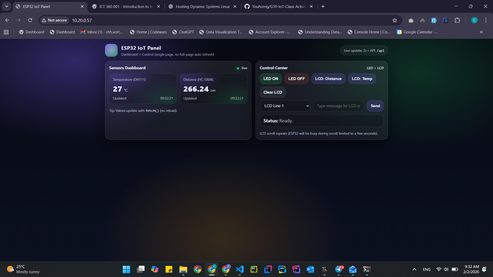
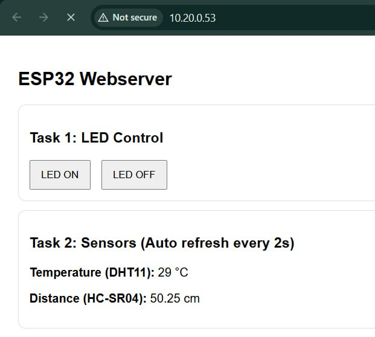
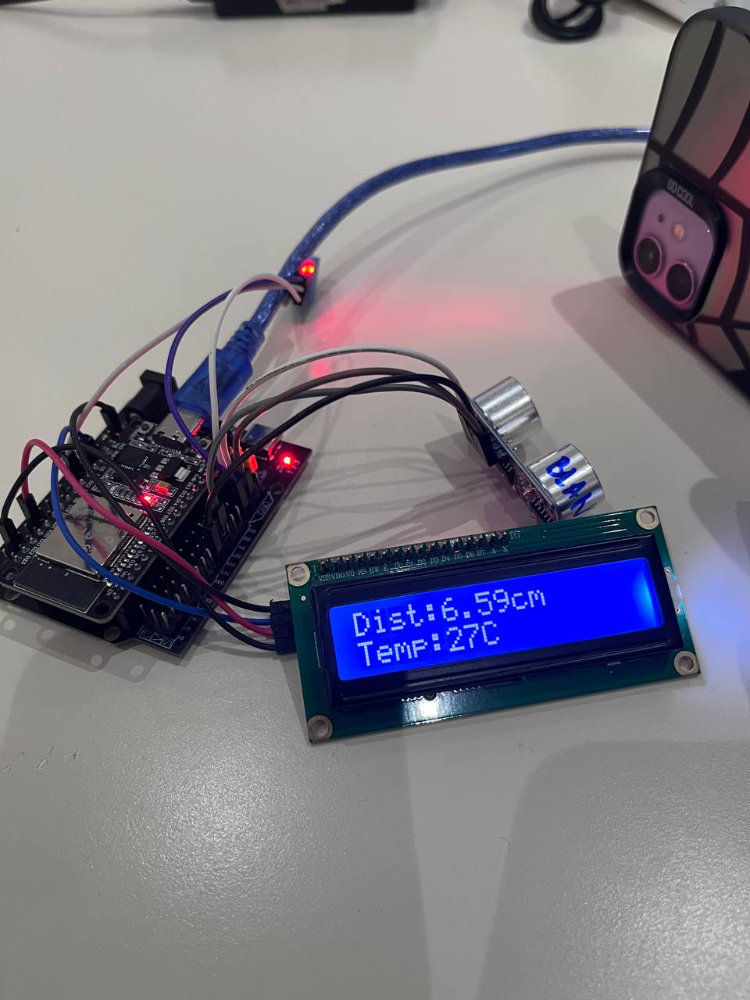
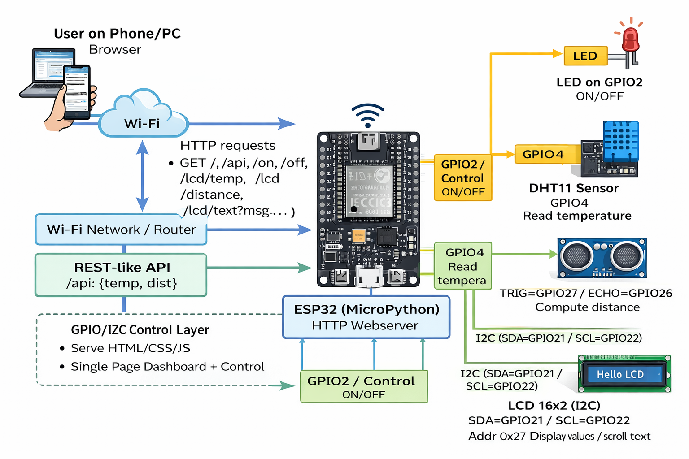

# Lab 2 - IoT Webserver with LED, Sensors, and LCD Control

## Overview

In this lab, we will design an ESP32-based IoT system with MicroPython that integrates a web interface and an LCD display. The system allows users to control an LED, read sensors, and send custom messages to the LCD through a webserver. This lab emphasizes interaction between web UI and hardware, giving students practice in event-driven IoT design.

## Hardware

- ESP32 Dev Board (MicroPython firmware flashed)
- DHT11 sensor (temperature/humidity)
- HC-SR04 ultrasonic distance sensor
- LCD 16×2 with I²C backpack
- LED (built-in or external on GPIO2)
- Breadboard, jumper wires

## Equipment

- ESP32 dev board
- DHT11 sensor
- HC-SR04 ultrasonic distance sensor
- LCD 16×2 with I²C backpack
- Breadboard, jumper wires
- USB cable + laptop with Thonny
- Wi-Fi access

## Wiring

This is the diagram for wiring setup with the available equipment.







### Pin Connections

| Component       | ESP32 Pin | Description                                  |
| --------------- | --------- | -------------------------------------------- |
| LED             | GPIO2     | Built-in LED (or external LED with resistor) |
| DHT11 Data      | GPIO4     | Temperature/Humidity sensor data pin         |
| HC-SR04 Trigger | GPIO27    | Ultrasonic sensor trigger pin                |
| HC-SR04 Echo    | GPIO26    | Ultrasonic sensor echo pin                   |
| LCD SDA         | GPIO21    | I²C data line (default SDA)                  |
| LCD SCL         | GPIO22    | I²C clock line (default SCL)                 |
| LCD VCC         | 5V        | Power supply for LCD                         |
| LCD GND         | GND       | Ground                                       |
| Sensors VCC     | 3.3V/5V   | Power supply for sensors                     |
| Sensors GND     | GND       | Ground                                       |

## Configuration

These are the main configuration settings to run all the tasks in this activity.

- Wi-Fi SSID and password
- I²C address for LCD
- GPIO pin assignments

```python
# Wi-Fi Configuration
WIFI_SSID = "YOUR_SSID"
WIFI_PASS = "YOUR_PASSWORD"

# Pin Configuration
LED_PIN = 2
DHT_PIN = 4
TRIG_PIN = 27
ECHO_PIN = 26
I2C_SDA = 21
I2C_SCL = 22
LCD_ADDR = 0x27
```

## Setup Instructions

1. Flash MicroPython firmware to ESP32 (if not already done).
2. Wire all components according to the wiring diagram above.
3. Download the required LCD library files (if not already in your project):
   - `lcd_api.py` - LCD API helper library [GitHub](https://github.com/Theara-Seng/iot_micropython/blob/main/session5/lcd/lib/machine_i2c_lcd.py)
   - `machine_i2c_lcd.py` - I²C LCD driver for ESP32 [GitHub](https://github.com/Theara-Seng/iot_micropython/blob/main/session5/lcd/lib/lcd_api.py)
   - These files can be found in MicroPython LCD I²C libraries online
4. Update the configuration in `main.py` with your Wi-Fi credentials:
   ```python
   SSID = "YOUR_WIFI_SSID"
   PASSWORD = "YOUR_WIFI_PASSWORD"
   ```
5. Upload all files to ESP32 using Thonny:
   - `main.py`
   - `lcd_api.py`
   - `machine_i2c_lcd.py`
6. Reset the ESP32 or run `main.py`.
7. Check the serial monitor for the ESP32's IP address.
8. Open a web browser and navigate to `http://<ESP32_IP_ADDRESS>`.

## Usage

### Web Interface Features

The web interface is a modern, single-page application with a premium dark theme design featuring:



#### **Sensors Dashboard**

- **Temperature Display** - Real-time DHT11 readings in °C
- **Distance Display** - Real-time HC-SR04 readings in cm
- **Auto-refresh** - Updates every 2 seconds automatically
- **Timestamp** - Shows last update time for each sensor
- **Error Handling** - Displays "Err" if sensor reading fails

#### **Control Center**

1. **LED Control**
   - Click "LED ON" button to turn on the LED (green button)
   - Click "LED OFF" button to turn off the LED (red button)
   - Instant feedback with status toast messages

2. **LCD Display Control**
   - **"LCD: Distance"** - Displays current distance on LCD line 1
   - **"LCD: Temp"** - Displays current temperature on LCD line 2
   - **"Clear LCD"** - Clears both lines of the LCD
   - **Custom Text Input** - Type any message and click "Send to LCD"
   - **Auto-scroll** - Messages longer than 16 characters automatically scroll

3. **Status Toast**
   - Shows confirmation messages for all actions
   - Examples: "LED ON ✅", "Message sent to LCD ✅"

## API Endpoints

The ESP32 webserver exposes the following HTTP endpoints:

| Endpoint            | Method | Description                                        | Response                     |
| ------------------- | ------ | -------------------------------------------------- | ---------------------------- |
| `/`                 | GET    | Main web interface (HTML page)                     | HTML                         |
| `/api`              | GET    | JSON sensor data                                   | `{"temp": 25, "dist": 12.5}` |
| `/on`               | GET    | Turn LED ON                                        | 204 No Content               |
| `/off`              | GET    | Turn LED OFF                                       | 204 No Content               |
| `/lcd/distance`     | GET    | Show distance on LCD line 1                        | 204 No Content               |
| `/lcd/temp`         | GET    | Show temperature on LCD line 2                     | 204 No Content               |
| `/lcd/clear`        | GET    | Clear LCD display                                  | 204 No Content               |
| `/lcd/text?msg=...` | GET    | Display custom text on LCD (scrolls if > 16 chars) | 204 No Content               |

## Tasks & Checkpoints

### Task 1 - LED Control

**Objective:** Add two buttons (ON/OFF) on the web page to control the LED on GPIO2.

**Implementation:**

The LED control is implemented using two HTTP endpoints:

- `/on` - Sets GPIO2 to HIGH (LED ON)
- `/off` - Sets GPIO2 to LOW (LED OFF)

The web interface includes two buttons that send fetch requests to these endpoints:

```javascript
button onclick="act('/on','LED ON ✅')">LED ON</button>
button onclick="act('/off','LED OFF ✅')">LED OFF</button>
```

The ESP32 handles these requests and controls the LED:

```python
led = Pin(2, Pin.OUT)
if path == "/on":
    led.value(1)
elif path == "/off":
    led.value(0)
```

**Evidence:**


---

### Task 2 - Sensor Read

**Objective:** Read DHT11 temperature and ultrasonic distance, and display values on the web page with auto-refresh every 1-2 seconds.

**Implementation:**

Sensor readings are implemented using:

1. **DHT11 Temperature Sensor** - Connected to GPIO4

   ```python
   dht_sensor = dht.DHT11(Pin(4))
   def read_temp_c():
       dht_sensor.measure()
       return dht_sensor.temperature()
   ```

2. **HC-SR04 Ultrasonic Sensor** - Trigger on GPIO27, Echo on GPIO26

   ```python
   def read_distance_cm():
       trig.value(0)
       time.sleep_us(2)
       trig.value(1)
       time.sleep_us(10)
       trig.value(0)
       duration = time_pulse_us(echo, 1, 30000)
       dist = (duration * 0.0343) / 2
       return round(dist, 2)
   ```

3. **JSON API Endpoint** - `/api` returns sensor data in JSON format

   ```json
   { "temp": 25, "dist": 12.5 }
   ```

4. **Auto-refresh** - JavaScript polls the API every 2 seconds using `fetch()` and updates the display without page reload

**Evidence:**




---

### Task 3 - Sensor → LCD (20 pts)

**Objective:** Add two buttons to display sensor data on LCD:

- "Show Distance" → writes distance to LCD line 1
- "Show Temp" → writes temperature to LCD line 2

**Implementation:**

Two buttons on the web interface trigger HTTP requests to display sensor data on the LCD:

1. **Show Distance Button** - Endpoint: `/lcd/distance`

   ```python
   d = read_distance_cm()
   msg = "Distance: Err" if d is None else ("Distance:%scm" % d)
   lcd_write(0, msg)  # Write to line 0 (first line)
   ```

2. **Show Temp Button** - Endpoint: `/lcd/temp`
   ```python
   t = read_temp_c()
   msg = "Temp: Err" if t is None else ("Temp:%sC" % t)
   lcd_write(1, msg)  # Write to line 1 (second line)
   ```

The `lcd_write()` helper function clears the line and writes the text:

```python
def lcd_write(line, text):
    lcd.move_to(0, line)
    lcd.putstr(" " * 16)  # Clear line
    lcd.move_to(0, line)
    lcd.putstr((text or "")[:16])  # Write text (max 16 chars)
```

**Evidence:**




---

### Task 4 - Textbox → 

**Objective:** Add a textbox + "Send" button on the web page. User enters custom text → LCD displays it (scroll if >16 chars).

**Implementation:**

Custom text input is handled through:

1. **Web Interface** - Input field and Send button

   ```html
   <input id="msg" placeholder="Type message for LCD (scroll if > 16 chars)" />
   <button onclick="sendMsg()">Send to LCD</button>
   ```

2. **JavaScript Function** - Encodes and sends the message

   ```javascript
   async function sendMsg() {
     const v = document.getElementById("msg").value || "";
     const qs = encodeURIComponent(v);
     await act("/lcd/text?msg=" + qs, "Message sent to LCD ✅");
   }
   ```

3. **ESP32 Endpoint** - `/lcd/text?msg=...` receives and displays the message

   ```python
   raw = get_query_value(path, "msg")
   text = url_decode(raw).strip()
   if text == "":
       text = "Hello LCD"
   lcd_scroll(0, text)  # Scroll on line 0 if > 16 chars
   ```

4. **Scrolling Function** - Automatically scrolls text longer than 16 characters
   ```python
   def lcd_scroll(line, text, delay=0.22):
       if len(text) <= 16:
           lcd_write(line, text)
           return
       padded = text + " " * 16
       for i in range(len(padded) - 15):
           lcd_write(line, padded[i:i+16])
           time.sleep(delay)
   ```

**Evidence:**

[Task 4 Video](https://youtube.com/shorts/2kuhBz8zi2s)

---

**Demo Video:** [YouTube Link](https://www.youtube.com/shorts/IEQe3DOmxgQ)

---

## Technical Features

### 🔧 **Key Implementation Highlights**

1. **Non-Blocking Web Interface**
   - Single-page application with no meta-refresh
   - Background polling using JavaScript `fetch()` API
   - Page remains responsive during LCD scrolling (scrolling happens on ESP32)

2. **Error Handling**
   - Sensor read failures return `None` and display "Err" on web interface
   - Try-catch blocks prevent crashes from sensor errors
   - HTTP error handling with 500 status code fallback

3. **URL Encoding/Decoding**
   - Custom `url_decode()` function handles special characters
   - Supports spaces, punctuation, and common symbols in LCD messages
   - JavaScript `encodeURIComponent()` ensures proper encoding

4. **LCD Helper Functions**
   - `lcd_write()` - Clears line and writes text (max 16 chars)
   - `lcd_scroll()` - Automatically scrolls text longer than 16 characters
   - Configurable scroll delay (default 0.22s per character shift)

5. **Minimal Dependencies**
   - No JSON library needed (manual JSON string construction)
   - Lightweight HTTP server using raw sockets
   - Efficient memory usage for ESP32 constraints

## System Architecture



## Code Structure

```
lab2-webserver-lcd-control/
├── main.py              # Main webserver and hardware control logic
├── README.md            # This documentation file
└── screenshot/          # Evidence and documentation images
    ├── wiring_setup.png
    ├── component_setup.jpg
    ├── task1_led_control.gif
    ├── task2_sensor_readings.png
    ├── task3_lcd_sensor.jpg
    ├── task4_custom_text.gif
    └── system_architecture.png
```

**Main Components in `main.py`:**

- Wi-Fi connection setup
- Webserver implementation with socket programming
- Sensor reading functions (DHT11 and HC-SR04)
- LCD control functions (write, scroll)
- HTTP request handlers for all endpoints
- Embedded HTML/CSS/JavaScript for the web interface

## Troubleshooting

### Common Issues

1. **ESP32 won't connect to Wi-Fi**
   - Verify SSID and password are correct
   - Check if Wi-Fi network is 2.4GHz (ESP32 doesn't support 5GHz)
   - Ensure Wi-Fi signal strength is adequate

2. **LCD not displaying anything**
   - Check I²C address (try 0x27 or 0x3F)
   - Verify SDA and SCL connections
   - Adjust LCD contrast potentiometer on I²C backpack

3. **Sensor readings show errors**
   - DHT11: Ensure proper power supply and data pin connection
   - HC-SR04: Check trigger and echo pin connections
   - Add appropriate delays between sensor readings

4. **Web page not loading**
   - Verify ESP32 IP address from serial monitor
   - Ensure device is on the same network as ESP32
   - Check firewall settings


