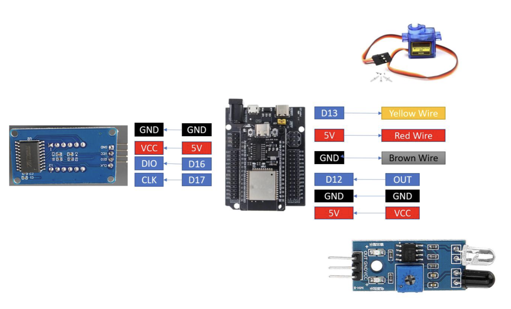
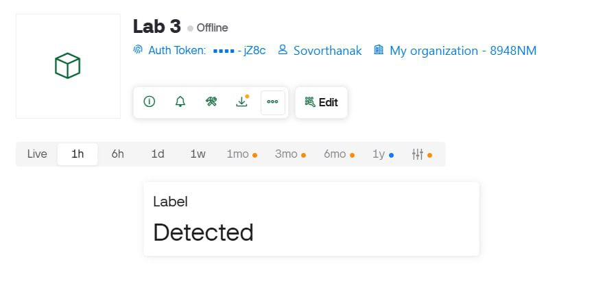

# Lab 3 - IoT Smart Gate Control with Blynk, IR Sensor, Servo Motor, and TM1637

## Overview

In this lab, we will design and implement an ESP32-based IoT system using MicroPython and the Blynk platform. The system integrates an IR sensor for object detection, a servo motor for physical actuation, and a TM1637 7-segment display for real-time local feedback. We will use the Blynk mobile application to remotely control the system, monitor sensor status, and observe system behavior.

## Learning Outcomes (CLO Alignment)

- Integrate multiple sensors and actuators into a single IoT system using ESP32
- Use Blynk to remotely control hardware and visualize system status
- Implement automatic and manual control logic based on sensor input and cloud commands
- Display system status and numerical data using a TM1637 7-segment display
- Document system wiring, logic flow, and IoT behavior clearly

## Hardware

- ESP32 Dev Board (MicroPython firmware flashed)
- IR Sensor Module (digital output)
- Servo Motor (SG90 or similar)
- TM1637 4-Digit 7-Segment Display
- Breadboard, jumper wires
- USB cable + laptop with Thonny
- Smartphone with Blynk app installed

## Equipment

- ESP32 dev board
- IR sensor module
- Servo motor (SG90)
- TM1637 7-segment display
- Breadboard, jumper wires
- USB cable + laptop with Thonny
- Wi-Fi access
- Smartphone (iOS/Android) with Blynk app

## Wiring

This is the diagram for wiring setup with the available equipment.



### Pin Connections

| Component     | ESP32 Pin | Description                        |
| ------------- | --------- | ---------------------------------- |
| IR Sensor VCC | 3.3V      | Power supply for IR sensor         |
| IR Sensor GND | GND       | Ground                             |
| IR Sensor OUT | GPIO12    | Digital output (LOW when detected) |
| Servo VCC     | 5V        | Power supply for servo motor       |
| Servo GND     | GND       | Ground                             |
| Servo Signal  | GPIO13    | PWM control signal                 |
| TM1637 VCC    | 3.3V      | Power supply for display           |
| TM1637 GND    | GND       | Ground                             |
| TM1637 CLK    | GPIO17    | Clock signal                       |
| TM1637 DIO    | GPIO16    | Data I/O signal                    |

## Configuration

These are the main configuration settings to run all the tasks in this activity.

- Blynk authentication token
- Wi-Fi SSID and password
- GPIO pin assignments
- Servo angle limits

```python
# Blynk Configuration
BLYNK_TOKEN = "YOUR_BLYNK_AUTH_TOKEN"
BLYNK_API = "http://blynk.cloud/external/api"

# Wi-Fi Configuration
WIFI_SSID = "YOUR_SSID"
WIFI_PASS = "YOUR_PASSWORD"

# Pin Configuration
IR_PIN = 12
SERVO_PIN = 13
TM_CLK = 17
TM_DIO = 16

# Servo Configuration
SERVO_CLOSED = 0    # Closed position (degrees)
SERVO_OPEN = 90     # Open position (degrees)
AUTO_DELAY = 1      # Time to keep gate open (seconds)
```

## Setup Instructions

### 1. Blynk Setup

1. Download and install the Blynk app from App Store (iOS) or Google Play (Android)
2. Create a new Blynk account or log in
3. Create a new project:
   - Project name: "Smart Gate Control"
   - Device: ESP32
   - Connection type: Wi-Fi
4. Copy the **Auth Token** sent to your email
5. Add the following widgets to your dashboard:
   - **Label Widget** (Virtual Pin V0) - IR Sensor Status (displays "Detected" or "Not Detected")
   - **Slider Widget** (Virtual Pin V1) - Manual Servo Control (0-180)
   - **Value Display** (Virtual Pin V2) - Detection Counter
   - **Switch Widget** (Virtual Pin V3) - Manual Override Mode

### 2. ESP32 Setup

1. Flash MicroPython firmware to ESP32 (if not already done)
2. Wire all components according to the wiring diagram above
3. Download the required library file:
   - `tm1637.py` - TM1637 display driver [GitHub](https://github.com/mcauser/micropython-tm1637)
4. Update the configuration in `Lab3_Main.py` with your credentials:
   ```python
   BLYNK_TOKEN = "YourAuthTokenFromEmail"
   WIFI_SSID = "YOUR_WIFI_SSID"
   WIFI_PASS = "YOUR_WIFI_PASSWORD"
   ```
5. Upload all files to ESP32 using Thonny:
   - `Lab3_Main.py`
   - `tm1637.py`
6. Reset the ESP32 or run `Lab3_Main.py`
7. Check the serial monitor for connection status
8. Open the Blynk app and verify the connection

## Usage

### Blynk Dashboard Features

The Blynk mobile app provides remote monitoring and control:


#### **Monitoring Widgets**

1. **IR Sensor Status (Label Widget - V0)**
   - Displays "Detected" when object is detected
   - Displays "Not Detected" when no object is present
   - Updates in real-time

2. **Detection Counter (Value Display - V2)**
   - Shows total number of detection events
   - Syncs with TM1637 display
   - Resets on ESP32 restart

#### **Control Widgets**

1. **Manual Servo Control (Slider - V1)**
   - Range: 0° to 180°
   - Drag slider to set servo position
   - Works only when manual mode is enabled
   - Real-time servo movement

2. **Manual Override Switch (Switch - V3)**
   - OFF: Automatic mode (IR sensor controls servo)
   - ON: Manual mode (IR sensor ignored, slider controls servo)

### Local Display (TM1637)

The 4-digit 7-segment display shows:

- **Detection counter** - Number of times IR sensor detected an object
- **Leading zeros** - Padded for clarity (e.g., "0042")
- **Brightness** - Adjustable in code (0-7)

### System Behavior

#### Automatic Mode (Default)

1. IR sensor continuously monitors for objects
2. When object detected:
   - Servo rotates to OPEN position (90°)
   - Counter increments by 1
   - TM1637 display updates
   - Blynk counter updates
   - IR status label shows "Detected"
3. After 1 second delay:
   - Servo returns to CLOSED position (0°)
4. System ready for next detection

#### Manual Mode

1. User enables manual override switch on Blynk
2. IR sensor readings are ignored
3. User controls servo position via slider (0-180°)
4. Counter does not increment
5. TM1637 shows last counter value

## API / Virtual Pins

The ESP32 communicates with Blynk using virtual pins:

| Virtual Pin | Type   | Direction | Description                                    |
| ----------- | ------ | --------- | ---------------------------------------------- |
| V0          | String | ESP → App | IR sensor status ("Detected" / "Not Detected") |
| V1          | Slider | App → ESP | Manual servo position (0-180)                  |
| V2          | Value  | ESP → App | Detection counter                              |
| V3          | Switch | App → ESP | Manual override mode (0=auto, 1=manual)        |

## Tasks & Checkpoints

### Task 1 - IR Sensor Reading

**Objective:** Read IR sensor digital output using ESP32 and display IR status (Detected / Not Detected) on Blynk.

**Implementation:**

The IR sensor module outputs a digital signal:

- **LOW (0)** when object is detected
- **HIGH (1)** when no object is present

```python
from machine import Pin
import urequests as requests

ir = Pin(12, Pin.IN)

def send_ir_status(status):
    url = f"{BLYNK_API}/update?token={BLYNK_TOKEN}&V0={status}"
    try:
        r = requests.get(url)
        r.close()
    except:
        print("HTTP Error (IR)")
```

The status is sent to Blynk via HTTP API on Virtual Pin V0:

```python
# In main loop
current = ir.value()
if current == 0:
    send_ir_status("Detected")
else:
    send_ir_status("Not%20Detected")
```

**Evidence:**



---

### Task 2 - Servo Motor Control via Blynk

**Objective:** Add a Blynk Slider widget to control servo position. Slider position from 0 to 180 degrees and the servo moves following the slider.

**Implementation:**

Servo control is implemented using PWM:

```python
from machine import Pin, PWM
import urequests as requests

servo = machine.PWM(Pin(13), freq=50)

def set_angle(angle):
    duty = int((angle / 180) * 102 + 26)
    servo.duty(duty)

def read_slider_v1():
    url = f"{BLYNK_API}/get?token={BLYNK_TOKEN}&v1"
    try:
        r = requests.get(url)
        value = int(str(r.text).strip('[]"'))
        r.close()
        return value
    except Exception as e:
        print("Failed to read slider:", e)
        return None
```

The main loop continuously reads the slider value:

```python
# In main loop
angle = read_slider_v1()
if angle is not None and angle != last_angle:
    angle = max(0, min(180, angle))
    set_angle(angle)
    last_angle = angle
```

**Evidence:**

[Task 2 - Servo Control Video](https://youtu.be/JnMRalt_NaY)

---

### Task 3 - Automatic IR-Servo Action

**Objective:** When IR sensor detects an object, servo opens automatically. After a short delay, servo returns to closed position.

**Implementation:**

The automatic gate logic runs in the main loop:

```python
def auto_open_servo():
    print("Auto opening servo")
    set_angle(SERVO_OPEN)
    time.sleep(AUTO_DELAY)
    print("Closing servo")
    set_angle(SERVO_CLOSED)

# In main loop
if not manual_override:
    current = ir.value()
    if current != prev_state:
        if current == 0:
            print("Detected")
            send_ir_status("Detected")

            # Increment counter
            ir_counter += 1
            display_counter(ir_counter)
            send_counter_v2(ir_counter)

            # Automatic servo
            auto_open_servo()
        else:
            send_ir_status("Not%20Detected")
        prev_state = current
```

**Evidence:**

[Task 3 - Automatic Gate Video](https://youtube.com/shorts/UL46Ju1LQi8)

---

### Task 4 - TM1637 Display Integration

**Objective:** Count the number of IR detection events. Display the counter value on the TM1637 display and send the same value to Blynk numeric display widget.

**Implementation:**

TM1637 display initialization and update:

```python
import tm1637
from machine import Pin
import urequests as requests

# Initialize TM1637
tm = tm1637.TM1637(Pin(17), Pin(16))
tm.set_brightness(7)  # Set brightness (0-7)

def display_counter(value):
    try:
        tm.show_number(value)
    except Exception as e:
        print("TM1637 display error:", e)

def send_counter_v2(counter):
    url = f"{BLYNK_API}/update?token={BLYNK_TOKEN}&V2={counter}"
    try:
        r = requests.get(url)
        r.close()
    except:
        print("HTTP Error (Counter)")
```

Counter increments on each detection:

```python
ir_counter = 0

# In IR detection handler
if current == 0:
    ir_counter += 1
    print("IR Count:", ir_counter)
    display_counter(ir_counter)
    send_counter_v2(ir_counter)
```

**Evidence:**

[Task 4 - TM1637 Display](https://youtube.com/shorts/E_47fxhAMRg)

---

### Task 5 - Manual Override Mode

**Objective:** Add a Blynk switch to enable/disable automatic IR mode. When manual mode is active, IR sensor is ignored.

**Implementation:**

Manual override is controlled by a Blynk switch on Virtual Pin V3:

```python
def read_manual_override_v3():
    """Read Blynk switch for manual override (0 = automatic, 1 = manual)"""
    url = f"{BLYNK_API}/get?token={BLYNK_TOKEN}&v3"
    try:
        r = requests.get(url)
        val = int(str(r.text).strip('[]"'))
        r.close()
        return val == 1  # True if manual override active
    except Exception as e:
        print("Failed to read manual override:", e)
        return False
```

The main loop checks the mode before processing IR sensor:

```python
# In main loop
manual_override = read_manual_override_v3()  # True if manual mode

if not manual_override:
    # Automatic mode - IR sensor controls servo
    current = ir.value()
    if current != prev_state:
        if current == 0:
            # Handle detection
            auto_open_servo()
        prev_state = current
else:
    # Manual override active - IR ignored
    prev_state = -1
    print("Manual override active - IR ignored")
```

**Evidence:**

[Task 5 - Manual Override Demo](https://youtube.com/shorts/_8cbKmmfn3Y?feature=share)

---

**Demo Video:** [YouTube Link](https://youtube.com/shorts/9V-JWfi_ZXU)

---

## Technical Features

### **Key Implementation Highlights**

1. **HTTP API Integration**
   - Blynk HTTP API for cloud communication using urequests
   - Polling-based architecture for reading virtual pins
   - RESTful API calls for updating sensor status and counter

2. **State Management**
   - `manual_override` flag for mode switching
   - `prev_state` to detect IR sensor state changes
   - `ir_counter` persistent counter
   - `last_angle` to prevent redundant servo movements

3. **PWM Servo Control**
   - 50Hz frequency for standard servo motors
   - Duty cycle calculation for precise angle control (0-180°)
   - Automatic open/close sequence with configurable delay

4. **TM1637 Display Driver**
   - 4-digit 7-segment display with brightness control
   - Direct number display using `show_number()` method
   - Real-time counter updates

5. **Blynk Integration**
   - HTTP GET requests for reading slider and switch values
   - HTTP GET requests for updating status and counter
   - Virtual pin mapping for sensors and actuators
   - Mobile app dashboard for remote monitoring

6. **Error Handling**
   - Wi-Fi connection timeout logic
   - Try-except blocks for HTTP requests
   - Graceful handling of API failures

## System Architecture

```
┌─────────────────────────────────────────────────────────────┐
│                      Blynk Cloud Server                     │
│                    (blynk.cloud/external/api)               │
└─────────────────────────────────────────────────────────────┘
                            ▲ │
                            │ │ HTTP API (urequests)
                            │ ▼
┌─────────────────────────────────────────────────────────────┐
│                         ESP32                               │
│  ┌──────────────────────────────────────────────────────┐   │
│  │              MicroPython Runtime                     │   │
│  │  ┌────────────┐  ┌──────────┐  ┌─────────────┐       │   │
│  │  │ urequests  │  │ TM1637   │  │ Servo PWM   │       │   │
│  │  │ (HTTP API) │  │ Driver   │  │ Control     │       │   │
│  │  └────────────┘  └──────────┘  └─────────────┘       │   │
│  │  ┌──────────────────────────────────────────────┐    │   │
│  │  │         Main Control Logic                   │    │   │
│  │  │  - Auto/Manual Mode Polling                  │    │   │
│  │  │  - IR Detection Handler                      │    │   │
│  │  │  - Counter Management                        │    │   │
│  │  │  - HTTP API Read/Write Functions             │    │   │
│  │  └──────────────────────────────────────────────┘    │   │
│  └──────────────────────────────────────────────────────┘   │
└─────────────────────────────────────────────────────────────┘
         │              │              │              │
         ▼              ▼              ▼              ▼
    ┌────────┐    ┌─────────┐    ┌────────┐    ┌─────────┐
    │   IR   │    │  Servo  │    │ TM1637 │    │  Blynk  │
    │ Sensor │    │  Motor  │    │Display │    │   App   │
    └────────┘    └─────────┘    └────────┘    └─────────┘
```


**Main Components in `Lab3_Main.py`:**

- Wi-Fi connection setup
- Blynk HTTP API integration using urequests
- IR sensor reading function
- Servo motor control with PWM
- TM1637 display update function
- HTTP API functions for reading/writing virtual pins
- Automatic gate control logic
- Manual override mode handling
- Main event loop

## Troubleshooting

### Common Issues

1. **ESP32 won't connect to Blynk**
   - Verify Auth Token is correct (check email)
   - Ensure Wi-Fi credentials are correct
   - Check if ESP32 is connected to Wi-Fi (serial monitor)
   - Verify Blynk server is accessible (blynk.cloud)

2. **Servo not moving**
   - Check power supply (servo needs 5V, not 3.3V)
   - Verify PWM signal wire connection to GPIO14
   - Test with manual slider control first
   - Check servo duty cycle values (26-128 for SG90)

3. **IR sensor not detecting**
   - Adjust sensor sensitivity potentiometer
   - Check if sensor LED lights up when object is near
   - Verify sensor output is connected to GPIO13
   - Test sensor output with multimeter (should be LOW when detected)

4. **TM1637 display not showing numbers**
   - Check CLK and DIO connections (GPIO18, GPIO19)
   - Verify power supply (3.3V or 5V depending on module)
   - Test with simple display code first
   - Adjust brightness level in code

5. **Counter not incrementing**
   - Check if automatic mode is enabled (switch OFF on Blynk)
   - Verify IR sensor is working
   - Add debug print statements to detection handler
   - Check if `detection_count` variable is being updated

6. **Blynk widgets not updating**
   - Ensure `blynk.run()` is called in main loop
   - Check virtual pin numbers match widget configuration
   - Verify ESP32 is connected to Blynk (check app status)
   - Add delay between `blynk.run()` calls (recommended 50-100ms)
