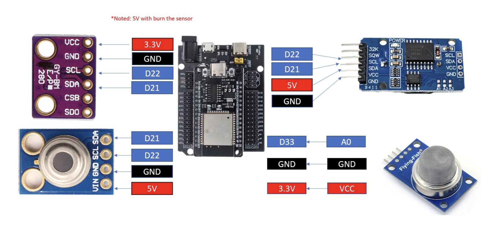
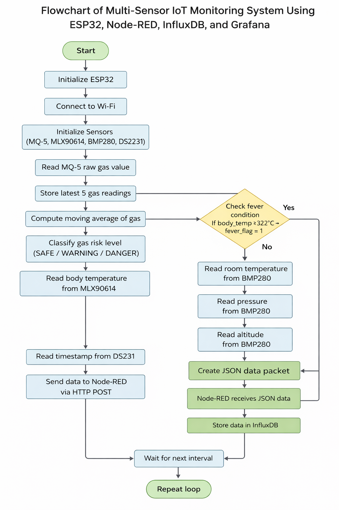
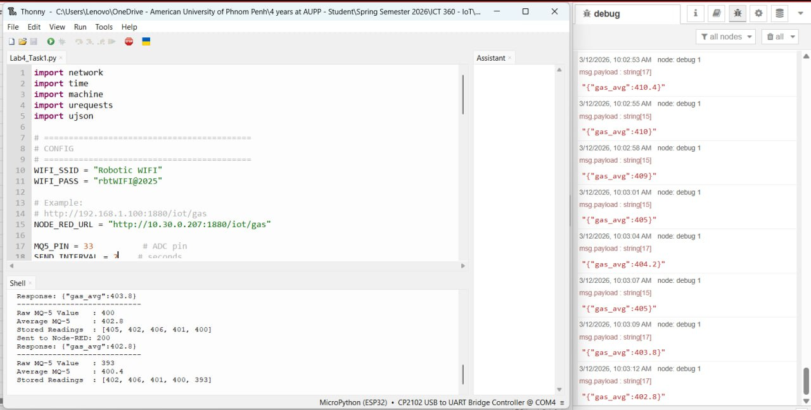
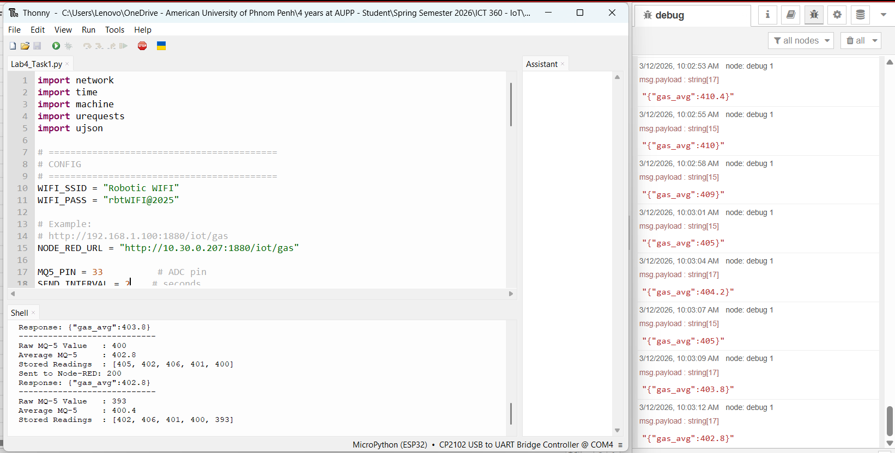
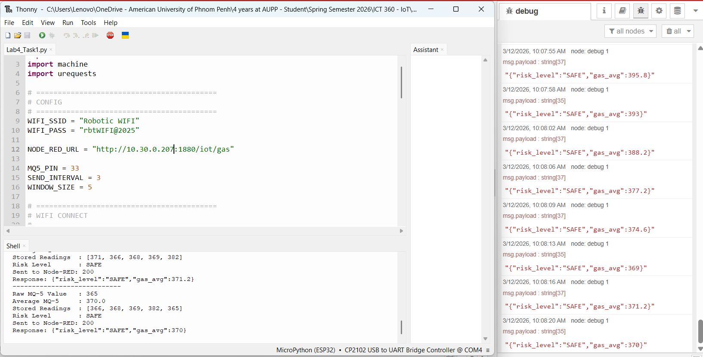
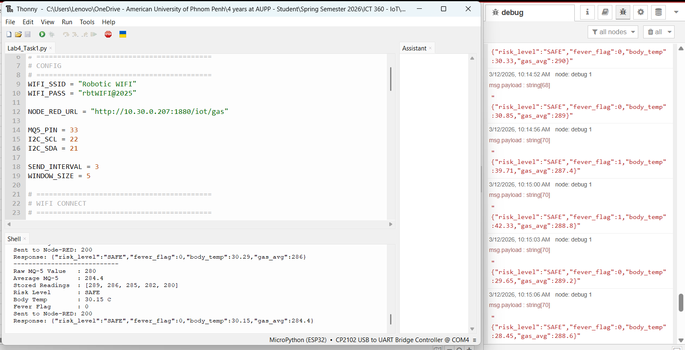
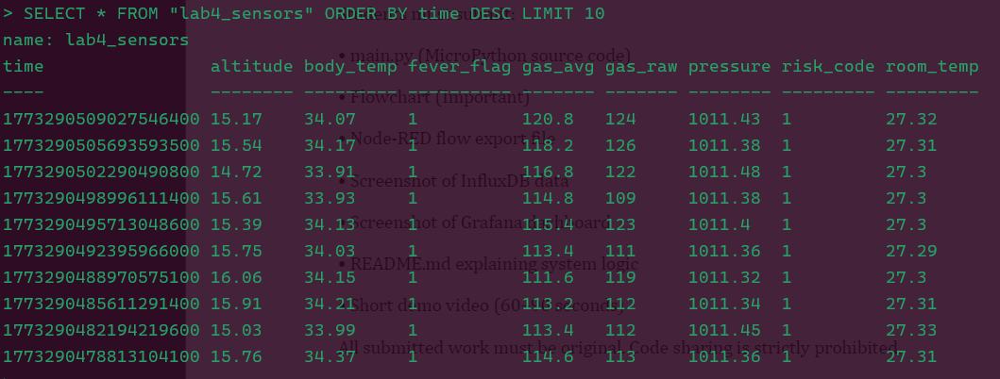
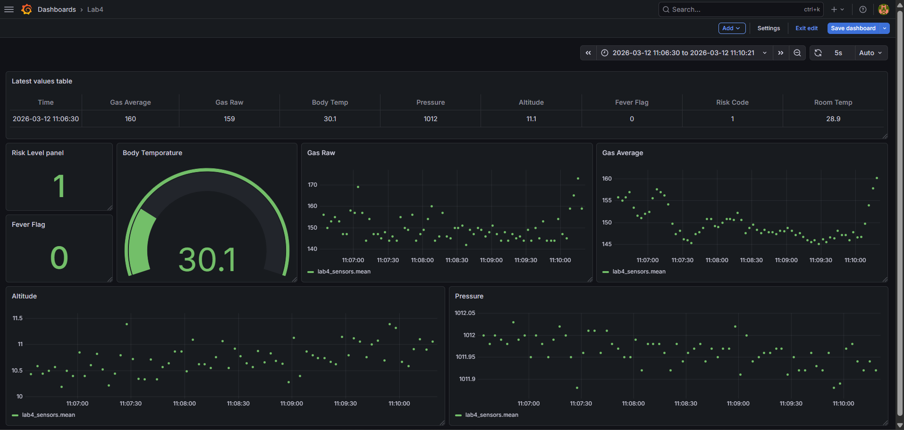

# Lab 4 - Multi-Sensor IoT Monitoring with Grafana Dashboard

## Overview

In this lab, we will design and implement a multi-sensor IoT monitoring system using ESP32 and MicroPython (Thonny). The system integrates an MLX90614 (infrared body temperature sensor), MQ-5 (gas sensor), BMP280 (room temperature, pressure, and altitude), and DS3231 (RTC for timestamps). Before transmitting data, the ESP32 performs edge logic processing — including moving average filtering, gas risk classification, and fever detection — then sends structured JSON packets to Node-RED, where data is stored in InfluxDB and visualised in a Grafana dashboard.

## Learning Outcomes (CLO Alignment)

- Integrate multiple I2C and analog sensors with ESP32
- Implement moving average filtering for noisy analog sensor signals
- Create rule-based classification logic at the edge (gas risk, fever detection)
- Structure JSON packets for IoT data transmission
- Store time-series sensor data in InfluxDB via Node-RED
- Design and configure multi-panel dashboards using Grafana

## Hardware

- ESP32 Dev Board (MicroPython firmware flashed)
- MLX90614 Infrared Body Temperature Sensor (I2C)
- MQ-5 Gas Sensor (analog output)
- BMP280 Barometric Pressure Sensor (I2C)
- DS3231 Real-Time Clock Module (I2C)
- Breadboard, jumper wires
- USB cable + laptop with Thonny

## Equipment

- ESP32 dev board
- MLX90614 sensor module
- MQ-5 gas sensor module
- BMP280 sensor module
- DS3231 RTC module
- Breadboard & jumper wires
- USB cable + laptop with Thonny
- Wi-Fi access
- PC running Node-RED, InfluxDB, and Grafana (local or server)

## Wiring

This is the diagram for the wiring setup with the available equipment.



### Pin Connections

| Component    | ESP32 Pin | Protocol | Description                      |
| ------------ | --------- | -------- | -------------------------------- |
| MLX90614 VCC | 3.3V      | —        | Power supply                     |
| MLX90614 GND | GND       | —        | Ground                           |
| MLX90614 SDA | GPIO21    | I2C      | I2C data line                    |
| MLX90614 SCL | GPIO22    | I2C      | I2C clock line                   |
| BMP280 VCC   | 3.3V      | —        | Power supply                     |
| BMP280 GND   | GND       | —        | Ground                           |
| BMP280 SDA   | GPIO21    | I2C      | Shared I2C data line             |
| BMP280 SCL   | GPIO22    | I2C      | Shared I2C clock line            |
| DS3231 VCC   | 3.3V      | —        | Power supply                     |
| DS3231 GND   | GND       | —        | Ground                           |
| DS3231 SDA   | GPIO21    | I2C      | Shared I2C data line             |
| DS3231 SCL   | GPIO22    | I2C      | Shared I2C clock line            |
| MQ-5 VCC     | 5V        | —        | Power supply (requires 5V)       |
| MQ-5 GND     | GND       | —        | Ground                           |
| MQ-5 AOUT    | GPIO33    | ADC      | Analog output (12-bit ADC input) |

> **Note:** MLX90614, BMP280, and DS3231 share the same I2C bus (GPIO21/GPIO22) since each has a unique I2C address. The MQ-5 sensor requires 5V but its analog output is safe for the ESP32 ADC at 3.3V logic.

## Configuration

These are the main configuration settings used across all tasks.

- Wi-Fi SSID and password
- Node-RED host and port
- GPIO pin assignments
- Sensor I2C addresses

```python
# Wi-Fi Configuration
WIFI_SSID = "Robotic WIFI"
WIFI_PASS = "rbtWIFI@2025"

# Node-RED Configuration
NODE_RED_URL = "http://10.30.0.207:1880/iot/gas"

# Pin Configuration
MQ5_PIN = 33      # ADC pin for MQ-5 gas sensor

# I2C Bus (shared by MLX90614, BMP280, DS3231)
I2C_SDA = 21
I2C_SCL = 22

# Edge Logic Thresholds
GAS_WINDOW_SIZE = 5       # Moving average window
GAS_WARNING_THRESHOLD = 2100
GAS_DANGER_THRESHOLD  = 2600
FEVER_THRESHOLD = 32.5    # Degrees Celsius (object temperature)
```

## Setup Instructions

### 1. Node-RED Setup

1. Install Node-RED on your PC or server (if not already installed):
   ```bash
   npm install -g --unsafe-perm node-red
   node-red
   ```
2. Open Node-RED in your browser at `http://localhost:1880`
3. Install the InfluxDB output node via **Manage Palette**:
   - Search for `node-red-contrib-influxdb` and install
4. Create a flow with the following nodes:
   - **HTTP In** node — method: `POST`, URL: `/iot/gas`
   - **JSON** node — parse the incoming payload
   - **InfluxDB Out** node — configure your database connection (see InfluxDB Setup)
5. Deploy the flow

### 2. InfluxDB Setup

1. Install and start InfluxDB (v1.x recommended for simplicity):
   ```bash
   brew install influxdb@1
   influxd
   ```
2. Create a database for this lab:
   ```bash
   influx
   > CREATE DATABASE iot_lab4
   > EXIT
   ```
3. In the Node-RED InfluxDB node, set:
   - **Host:** `localhost`
   - **Port:** `8086`
   - **Database:** `iot_lab4`
   - **Measurement:** `lab4_sensors`

### 3. Grafana Setup

1. Install and start Grafana:
   ```bash
   brew install grafana
   brew services start grafana
   ```
2. Open Grafana at `http://localhost:3000` (default credentials: `admin` / `admin`)
3. Add InfluxDB as a data source:
   - **Configuration → Data Sources → Add data source**
   - Select **InfluxDB**
   - URL: `http://localhost:8086`
   - Database: `iot_lab4`
4. Create a new dashboard and add panels for each sensor metric (see Task 4)

### 4. ESP32 Setup

1. Flash MicroPython firmware to ESP32 (if not already done)
2. Wire all components according to the wiring diagram above
3. Download required MicroPython libraries:
   - `mlx90614.py` — MLX90614 driver
   - `bmp280.py` — BMP280 driver
   - `ds3231.py` — DS3231 RTC driver
4. Update configuration in `lab4_main.py`:
   ```python
   WIFI_SSID = "Robotic WIFI"
   WIFI_PASS = "rbtWIFI@2025"
   NODE_RED_URL = "http://10.30.0.207:1880/iot/gas"
   ```
5. Upload all files to ESP32 using Thonny:
   - `lab4_main.py`
   - `mlx90614.py`
   - `bmp280.py`
   - `ds3231.py`
6. Run `lab4_main.py` and check the serial monitor for output

## System Description

The ESP32 continuously reads sensor data from all modules. Before sending data to Node-RED, the following edge logic is applied:

1. **Gas readings** are filtered using a moving average of the last 5 ADC samples.
2. **Gas level** is classified as `SAFE`, `WARNING`, or `DANGER` based on thresholds.
3. **Fever detection** logic is applied to the MLX90614 object temperature reading.
4. **Pressure and altitude** from BMP280 are transmitted as-is.
5. **Timestamp** is generated from DS3231 and included in the JSON packet.

The structured JSON payload is sent via HTTP POST to Node-RED, stored in InfluxDB, and visualised in Grafana.

### JSON Payload Structure

```json
{
  "timestamp": "2025-01-01T10:00:00",
  "gas_raw": 1850,
  "gas_avg": 1870.0,
  "risk_level": "SAFE",
  "body_temp": 36.5,
  "fever_flag": 0,
  "room_temp": 24.5,
  "pressure": 1013.25,
  "altitude": 45.2
}
```

## System Architecture



```
┌──────────────────────────────────────────────────────────────┐
│                          ESP32                               │
│  ┌────────────────────────────────────────────────────────┐  │
│  │                  MicroPython Runtime                   │  │
│  │                                                        │  │
│  │  ┌──────────┐  ┌──────────┐  ┌────────┐  ┌────────┐    │  │
│  │  │ MLX90614 │  │  BMP280  │  │  MQ-5  │  │DS3231  │    │  │
│  │  │  Driver  │  │  Driver  │  │  ADC   │  │ (RTC)  │    │  │
│  │  └──────────┘  └──────────┘  └────────┘  └────────┘    │  │
│  │                                                        │  │
│  │  ┌──────────────────────────────────────────────────┐  │  │
│  │  │              Edge Logic Processing               │  │  │
│  │  │  - Moving Average Filter (MQ-5, window=5)        │  │  │
│  │  │  - Gas Risk Classification (SAFE/WARN/DANGER)    │  │  │
│  │  │  - Fever Detection (threshold 32.5°C)            │  │  │
│  │  │  - JSON Packet Assembly                          │  │  │
│  │  └──────────────────────────────────────────────────┘  │  │
│  │                        │ HTTP POST                     │  │
│  └────────────────────────┼───────────────────────────────┘  │
└───────────────────────────┼──────────────────────────────────┘
                            ▼
          ┌─────────────────────────────────┐
          │           Node-RED              │
          │  HTTP In → JSON Parse → InfluxDB│
          └─────────────────────────────────┘
                            │
                            ▼
          ┌─────────────────────────────────┐
          │           InfluxDB              │
          │   Time-series data storage      │
          │   Database: iot_lab4            │
          └─────────────────────────────────┘
                            │
                            ▼
          ┌─────────────────────────────────┐
          │            Grafana              │
          │   Multi-panel IoT Dashboard     │
          └─────────────────────────────────┘
```

## Tasks & Checkpoints

### Task 1 - Gas Filtering (Moving Average)

**Objective:** Read the MQ-5 gas sensor using the ESP32 ADC, apply a moving average filter over the last 5 readings, and print both raw and averaged values. Send the averaged value to Node-RED.

**Implementation:**

The MQ-5 analog signal is read using the 12-bit ADC (range 0–4095). A circular buffer stores the last 5 samples and the average is computed on each iteration:

```python
from machine import ADC, Pin
import urequests
import json

adc = ADC(Pin(33))
adc.atten(ADC.ATTN_11DB)
adc.width(ADC.WIDTH_12BIT)

gas_readings = []
WINDOW_SIZE = 5

def get_moving_average(new_value):
    gas_readings.append(new_value)
    if len(gas_readings) > WINDOW_SIZE:
        gas_readings.pop(0)
    return sum(gas_readings) / len(gas_readings)

# In main loop
gas_raw = adc.read()
gas_avg = get_moving_average(gas_raw)
print("Gas Raw:", gas_raw, "| Gas Avg:", gas_avg)
```



---

### Task 2 - Gas Risk Classification

**Objective:** Classify the averaged gas reading into three risk categories and include the result in the Node-RED payload.

**Classification Rules:**

| Averaged ADC Value | Risk Level |
| ------------------ | ---------- |
| < 2100             | `SAFE`     |
| 2100 – 2599        | `WARNING`  |
| ≥ 2600             | `DANGER`   |

**Implementation:**

```python
def classify_risk(avg_value):
    if avg_value < 2100:
        return "SAFE"
    elif avg_value < 2600:
        return "WARNING"
    else:
        return "DANGER"

# In main loop
risk_level = classify_risk(gas_avg)
print("Risk Level:", risk_level)
```

The `risk_level` string is included as a field in the JSON packet sent to Node-RED.






---

### Task 3 - Fever Detection Logic

**Objective:** Read the MLX90614 object temperature, apply a threshold-based fever detection rule, and send the `fever_flag` field to Node-RED.

**Detection Rule:**

- If `body_temp ≥ 32.5°C` → `fever_flag = 1`
- Else → `fever_flag = 0`

**Implementation:**

```python
from machine import I2C, Pin
import mlx90614

i2c = I2C(0, sda=Pin(21), scl=Pin(22), freq=100000)
sensor = mlx90614.MLX90614(i2c)

FEVER_THRESHOLD = 32.5

def get_fever_flag(body_temp):
    return 1 if body_temp >= 32.5 else 0

# In main loop
body_temp = mlx.object_temp()
fever_flag = get_fever_flag(body_temp)
print("Body Temp:", body_temp, "°C | Fever Flag:", fever_flag)
```



---

### Task 4 - Pressure, Altitude Monitoring & Grafana Dashboard

**Objective:** Read pressure and altitude from BMP280, include a DS3231 timestamp, send everything to Node-RED/InfluxDB, and build a complete Grafana dashboard.

**Implementation — BMP280 & DS3231 Reading:**

```python
from machine import I2C, Pin
import bmp280
import ds3231

i2c = I2C(0, sda=Pin(21), scl=Pin(22), freq=100000)
bmp = bmp280.BMP280(i2c)
rtc = ds3231.DS3231(i2c)

# In main loop
pressure = bmp.pressure    # hPa
altitude = bmp.altitude    # meters (approximate based on sea-level pressure)
dt = rtc.datetime()        # Returns (year, month, day, weekday, hour, min, sec, subsec)
timestamp = "{:04d}-{:02d}-{:02d}T{:02d}:{:02d}:{:02d}".format(
    dt[0], dt[1], dt[2], dt[4], dt[5], dt[6]
)
print("Pressure:", pressure, "hPa | Altitude:", altitude, "m")
print("Timestamp:", timestamp)
```

**Implementation — JSON Payload & HTTP POST to Node-RED:**

```python
import urequests
import json

NODE_RED_URL = "http://10.30.0.207:1880/iot/gas"

def send_to_nodered(payload):
    try:
        response = urequests.post(NODE_RED_URL, json=payload)
        print("Sent to Node-RED:", response.status_code)
        response.close()
    except Exception as e:
        print("Failed to send data:", e)
```

**Grafana Dashboard Panels:**

Create the following panels in a single Grafana dashboard (data source: InfluxDB `iot_lab4`):

| Panel # | Panel Title          | Panel Type  | InfluxDB Field |
| ------- | -------------------- | ----------- | -------------- |
| 1       | Gas Average          | Time Series | `gas_avg`      |
| 2       | Gas Risk Level       | Stat/Text   | `risk_level`   |
| 3       | Body Temperature     | Gauge       | `body_temp`    |
| 4       | Atmospheric Pressure | Time Series | `pressure`     |
| 5       | Altitude             | Time Series | `altitude`     |
| 6       | Room Temperature     | Gauge       | `room_temp`    |

Example InfluxQL queries for Grafana:

```sql
-- Gas Average (Time Series)
SELECT mean("gas_avg") FROM "sensor_readings" WHERE $timeFilter GROUP BY time($__interval)

-- Body Temperature (Gauge)
SELECT last("body_temp") FROM "sensor_readings" WHERE $timeFilter

-- Pressure (Time Series)
SELECT mean("pressure") FROM "sensor_readings" WHERE $timeFilter GROUP BY time($__interval)

-- Altitude (Time Series)
SELECT mean("altitude") FROM "sensor_readings" WHERE $timeFilter GROUP BY time($__interval)

-- Risk Level (Stat)
SELECT last("risk_level") FROM "sensor_readings" WHERE $timeFilter
```






[YouTube Video Demo](https://youtu.be/JF9yqdEX5WU)

---

## Technical Features

### Key Implementation Highlights

1. **Moving Average Filter**
   - Circular buffer storing the last 5 ADC readings from MQ-5
   - Smooths out noise inherent in gas sensor analog output
   - Computed each loop iteration before classification

2. **Rule-Based Edge Classification**
   - Gas risk classified at the edge (on ESP32) before transmission
   - Fever detection flag computed locally — no cloud dependency
   - Reduces unnecessary data volume sent to Node-RED

3. **I2C Multi-Device Bus**
   - MLX90614, BMP280, and DS3231 share one I2C bus (SDA=GPIO21, SCL=GPIO22)
   - Each device has a unique I2C address (no conflict)
   - Single `I2C` object initialised once and shared across drivers

4. **Structured JSON Transmission**
   - All sensor values and computed fields packed into a single JSON object
   - Sent via HTTP POST using `urequests` to a Node-RED endpoint
   - Node-RED parses the payload and writes to InfluxDB

5. **Time-Series Storage (InfluxDB)**
   - Data stored as time-series measurements in the `iot_lab4` database
   - Each field (`gas_avg`, `body_temp`, `pressure`, `altitude`, etc.) stored separately
   - Enables efficient querying and visualisation in Grafana

6. **Grafana Dashboard**
   - Five panels covering all major sensor outputs
   - Mix of Time Series, Gauge, and Stat panel types
   - InfluxQL queries with Grafana template variables (`$timeFilter`, `$__interval`)

7. **Error Handling**
   - Try-except blocks around all HTTP requests and I2C reads
   - Falls back gracefully if a sensor read fails
   - Serial monitor output for debugging during development

