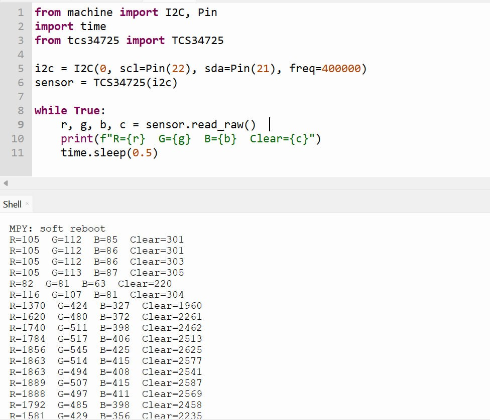
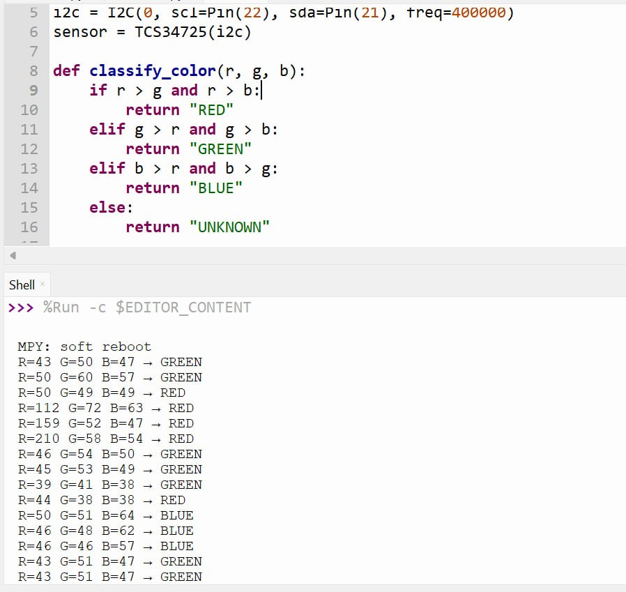

# Lab 5 - Smart Color Detection & Control with MIT App

## Overview

In this lab, we design and implement a color-based IoT control system using ESP32 and MicroPython (Thonny). The system integrates a TCS34725 color sensor, NeoPixel RGB LED strip, and a DC motor. Edge logic runs on the ESP32 to classify detected colors and control outputs accordingly. The system also hosts an HTTP server that communicates with an MIT App Inventor mobile app for real-time monitoring and manual control.

## Learning Outcomes (CLO Alignment)

- Integrate an I2C sensor (TCS34725) with ESP32
- Implement rule-based color classification logic at the edge
- Control a NeoPixel LED strip using RGB values
- Control DC motor speed using PWM
- Design a mobile app using MIT App Inventor
- Implement combined automatic and manual control systems

## Hardware

- ESP32 Dev Board (MicroPython firmware flashed)
- TCS34725 RGB Color Sensor (I2C)
- NeoPixel RGB LED Strip (24 LEDs)
- DC Motor with L298N Motor Driver
- Breadboard, jumper wires
- USB cable + laptop with Thonny

## Wiring

### Pin Connections

| Component       | ESP32 Pin | Protocol | Description              |
| --------------- | --------- | -------- | ------------------------ |
| TCS34725 VCC    | 3.3V      | —        | Power supply             |
| TCS34725 GND    | GND       | —        | Ground                   |
| TCS34725 SDA    | GPIO21    | I2C      | I2C data line            |
| TCS34725 SCL    | GPIO22    | I2C      | I2C clock line           |
| NeoPixel Data   | GPIO23    | Digital  | NeoPixel data signal     |
| NeoPixel VCC    | 5V        | —        | Power supply             |
| NeoPixel GND    | GND       | —        | Ground                   |
| Motor ENA (PWM) | GPIO14    | PWM      | Motor speed control      |
| Motor IN1       | GPIO26    | Digital  | Motor direction control  |
| Motor IN2       | GPIO27    | Digital  | Motor direction control  |

## Configuration

```python
# WiFi credentials
SSID = "Robotic WIFI"
PASSWORD = "rbtWIFI@2025"

# I2C Bus
I2C_SDA = 21
I2C_SCL = 22

# NeoPixel
NEOPIXEL_PIN = 23
NEOPIXEL_COUNT = 24

# Motor driver pins
ENA_PIN = 14   # PWM speed control
IN1_PIN = 26
IN2_PIN = 27
```

## Setup Instructions

### 1. ESP32 Setup

1. Flash MicroPython firmware to ESP32 (if not already done)
2. Wire all components according to the wiring table above
3. Upload the required MicroPython driver to the ESP32:
   - `tcs34725.py` — TCS34725 color sensor driver
4. Update WiFi credentials in `task5.py` if needed
5. Upload `task5.py` to the ESP32 and run it via Thonny
6. Note the IP address printed to the serial monitor — this is needed for the MIT App

### 2. MIT App Inventor Setup

1. Open [MIT App Inventor](https://appinventor.mit.edu) and create a new project
2. Add the following UI components:
   - **Label** — displays the currently detected color
   - **Button** — Forward
   - **Button** — Stop
   - **Button** — Backward
   - **TextBox** — R value input
   - **TextBox** — G value input
   - **TextBox** — B value input
   - **Button** — Set NeoPixel color
3. Configure each button to send HTTP GET requests to the ESP32:
   - Detected color: `GET http://<ESP32_IP>/color`
   - Forward: `GET http://<ESP32_IP>/forward`
   - Stop: `GET http://<ESP32_IP>/stop`
   - Backward: `GET http://<ESP32_IP>/backward`
   - Set RGB: `GET http://<ESP32_IP>/rgb?r=<R>&g=<G>&b=<B>`

## System Description

The ESP32 continuously reads RGB values from the TCS34725 sensor. Based on the detected color, it performs the following steps each iteration:

1. Read raw R, G, B, and clear values from the TCS34725 sensor
2. Classify the detected color (RED, GREEN, BLUE, or UNKNOWN) using rule-based logic
3. Set the NeoPixel strip to match the classified color
4. Adjust motor speed and direction using PWM based on the color
5. Serve HTTP requests from the MIT App for status polling and manual overrides

### Color Classification Logic

```python
def classify_color(r, g, b):
    if r < 50 and g < 50 and b < 50:
        return "UNKNOWN"
    if r > g * 1.3 and r > b * 1.3:
        return "RED"
    elif g > r * 1.3 and g > b * 1.3:
        return "GREEN"
    elif b > r * 1.3 and b > g * 1.3:
        return "BLUE"
    else:
        return "UNKNOWN"
```

A 30% dominance threshold is used so that only clearly dominant channels are classified, avoiding false positives on mixed or near-white light.

### Motor Speed Mapping

| Detected Color | PWM Duty | Direction |
| -------------- | -------- | --------- |
| RED            | 900      | Forward   |
| GREEN          | 700      | Forward   |
| BLUE           | 500      | Forward   |
| UNKNOWN        | 0        | Stop      |

### HTTP API Endpoints

| Endpoint               | Description                        |
| ---------------------- | ---------------------------------- |
| `GET /color`           | Returns the currently detected color string |
| `GET /forward`         | Drives motor forward at duty 700   |
| `GET /backward`        | Drives motor backward at duty 700  |
| `GET /stop`            | Stops the motor                    |
| `GET /rgb?r=&g=&b=`    | Sets NeoPixel to a custom RGB color |

## System Architecture

```
┌──────────────────────────────────────────────────────────┐
│                         ESP32                            │
│  ┌────────────────────────────────────────────────────┐  │
│  │               MicroPython Runtime                  │  │
│  │                                                    │  │
│  │  ┌──────────────┐  ┌────────────┐  ┌───────────┐  │  │
│  │  │   TCS34725   │  │  NeoPixel  │  │  DC Motor │  │  │
│  │  │  I2C Driver  │  │  (GPIO23)  │  │  (PWM)    │  │  │
│  │  └──────────────┘  └────────────┘  └───────────┘  │  │
│  │                                                    │  │
│  │  ┌──────────────────────────────────────────────┐  │  │
│  │  │            Edge Logic Processing             │  │  │
│  │  │  - RGB Reading from TCS34725                 │  │  │
│  │  │  - Color Classification (RED/GREEN/BLUE)     │  │  │
│  │  │  - NeoPixel color output                     │  │  │
│  │  │  - Motor PWM speed control                   │  │  │
│  │  └──────────────────────────────────────────────┘  │  │
│  │                       │ HTTP (port 80)             │  │
│  └───────────────────────┼────────────────────────────┘  │
└──────────────────────────┼──────────────────────────────┘
                           ▼
         ┌─────────────────────────────────┐
         │        MIT App Inventor         │
         │  - Color display label          │
         │  - Forward / Stop / Backward    │
         │  - Manual RGB NeoPixel control  │
         └─────────────────────────────────┘
```

## Tasks & Checkpoints

### Task 1 - RGB Reading

**Objective:** Read raw RGB values from the TCS34725 sensor and print them to the serial monitor.

**Implementation:**

```python
from machine import I2C, Pin
from tcs34725 import TCS34725

i2c = I2C(0, scl=Pin(22), sda=Pin(21), freq=400000)
sensor = TCS34725(i2c)

r, g, b, c = sensor.read_raw()
print(f"R={r} G={g} B={b}")
```



---

### Task 2 - Color Classification

**Objective:** Classify the raw RGB reading into RED, GREEN, BLUE, or UNKNOWN using a 30% dominance rule.

**Classification Rules:**

| Condition                        | Result  |
| -------------------------------- | ------- |
| R < 50, G < 50, B < 50           | UNKNOWN |
| R > G×1.3 and R > B×1.3         | RED     |
| G > R×1.3 and G > B×1.3         | GREEN   |
| B > R×1.3 and B > G×1.3         | BLUE    |
| None of the above                | UNKNOWN |

```python
def classify_color(r, g, b):
    if r < 50 and g < 50 and b < 50:
        return "UNKNOWN"
    if r > g * 1.3 and r > b * 1.3:
        return "RED"
    elif g > r * 1.3 and g > b * 1.3:
        return "GREEN"
    elif b > r * 1.3 and b > g * 1.3:
        return "BLUE"
    else:
        return "UNKNOWN"
```



[YouTube Video Demo](https://youtu.be/fKdXNJY3K9k)

---

### Task 3 - NeoPixel Control

**Objective:** Set the NeoPixel strip color based on the classified color.

| Detected Color | NeoPixel Color   |
| -------------- | ---------------- |
| RED            | (255, 0, 0)      |
| GREEN          | (0, 255, 0)      |
| BLUE           | (0, 0, 255)      |
| UNKNOWN        | Off (0, 0, 0)    |

```python
def set_neopixel(color):
    if color == "RED":
        rgb = (255, 0, 0)
    elif color == "GREEN":
        rgb = (0, 255, 0)
    elif color == "BLUE":
        rgb = (0, 0, 255)
    else:
        rgb = (0, 0, 0)
    for i in range(np.n):
        np[i] = rgb
    np.write()
```

[YouTube Video Demo](https://youtu.be/ZLquMoAA9Xc)

---

### Task 4 - Motor Control (PWM)

**Objective:** Drive the DC motor at different speeds based on the detected color using PWM.

| Detected Color | PWM Duty |
| -------------- | -------- |
| RED            | 900      |
| GREEN          | 700      |
| BLUE           | 500      |
| UNKNOWN        | 0 (Stop) |

```python
def set_motor(color):
    if color == "UNKNOWN":
        ena.duty(0)
        in1.value(0)
        in2.value(0)
    else:
        in1.value(1)
        in2.value(0)
        if color == "RED":
            ena.duty(900)
        elif color == "GREEN":
            ena.duty(700)
        elif color == "BLUE":
            ena.duty(500)
```

[YouTube Video Demo](https://youtu.be/aDfcDJsTEWc)

---

### Task 5 - MIT App Integration

**Objective:** Build an MIT App Inventor app that polls the ESP32 for the detected color and provides manual motor and NeoPixel controls.

**App Features:**

- Label displaying the currently detected color (polled via `GET /color`)
- Forward, Stop, Backward buttons for manual motor control
- R, G, B input fields with a button to set a custom NeoPixel color via `GET /rgb?r=&g=&b=`

The ESP32 runs a non-blocking HTTP server on port 80. After each sensor read cycle, it checks for incoming connections and responds to app requests within the same main loop.

```python
# Non-blocking server accept in main loop
try:
    conn, addr = server.accept()
    request = conn.recv(512).decode()
    response = handle_request(request)
    conn.send("HTTP/1.1 200 OK\r\nAccess-Control-Allow-Origin: *\r\n\r\n" + response)
    conn.close()
except:
    pass
```

`Access-Control-Allow-Origin: *` is included in all responses so the MIT App web viewer can make cross-origin requests without being blocked.

---

## Technical Features

### Key Implementation Highlights

1. **TCS34725 Color Sensor (I2C)**
   - Reads raw 16-bit R, G, B, and clear channel values over I2C
   - Low-light threshold (`r < 50 and g < 50 and b < 50`) prevents false classification in dark conditions

2. **Rule-Based Edge Classification**
   - Color classification runs entirely on the ESP32
   - 30% dominance threshold avoids false positives on mixed or near-white light
   - No network dependency for core sensing logic

3. **NeoPixel RGB Control**
   - 24-LED strip driven from GPIO23
   - Both automatic (color-matched) and manual (app-commanded RGB) modes supported

4. **DC Motor PWM Speed Control**
   - ENA pin driven by PWM at 1 kHz
   - Three distinct speeds mapped to RED (fast), GREEN (medium), BLUE (slow)
   - Manual forward/backward/stop override available via the app

5. **Non-Blocking HTTP Server**
   - Server socket set to non-blocking (`setblocking(False)`)
   - `accept()` called inside a try-except so sensor reading is never stalled by waiting for app connections
   - Enables a ~300 ms sensor loop without blocking on network I/O

6. **MIT App Inventor Integration**
   - App communicates over Wi-Fi using plain HTTP GET requests
   - `CORS` header allows requests from the App Inventor web viewer
   - `/color` endpoint lets the app poll the current classification in real time
