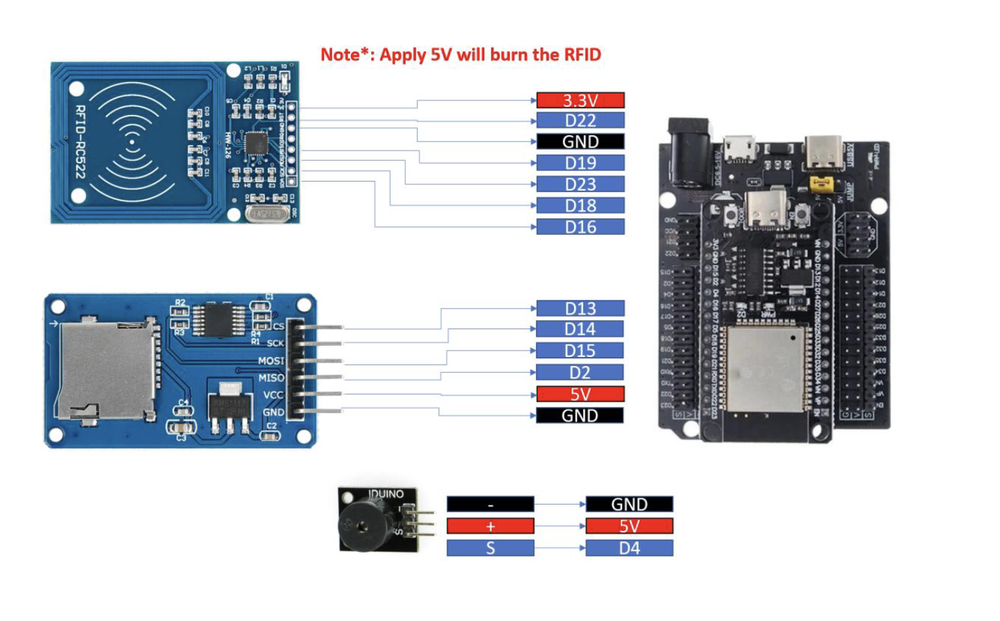
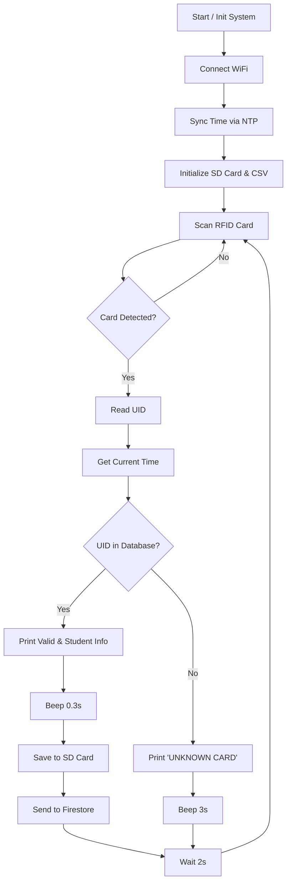
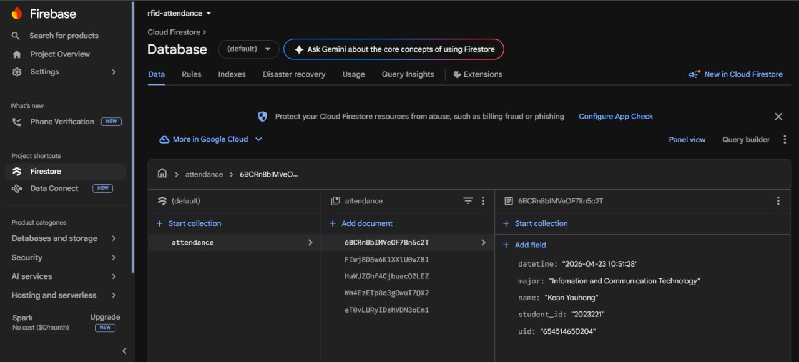

# Lab 6 - Smart RFID System with Cloud & SD Logging

## Overview

In this lab, we will design and implement a smart RFID-based attendance system using ESP32 and MicroPython (Thonny). The system integrates RFID-RC522, SD card, Firestore, and a buzzer. The system identifies users, logs attendance locally and remotely, and provides real-time feedback.

## Learning Outcomes (CLO Alignment)

- Integrate SPI-based RFID sensor (RC522) with ESP32
- Implement UID-based identification system
- Design structured data storage (CSV format)
- Store data locally (SD card) and remotely (Firestore)
- Implement real-time feedback using buzzer
- Apply system integration across multiple modules

## Hardware

- ESP32 Dev Board (MicroPython firmware flashed)
- RC522 RFID Reader (SPI)
- MicroSD Card Module (SPI)
- Active Buzzer
- Breadboard, jumper wires
- USB cable + laptop with Thonny

## Wiring



Configuration inside `main.py`:

### Pin Connections

| Component      | ESP32 Pin | Protocol | Description              |
| -------------- | --------- | -------- | ------------------------ |
| Buzzer (+)     | GPIO4     | Digital  | Buzzer control           |
| Buzzer (-)     | GND       | —        | Ground                   |
| RFID SCK       | GPIO18    | SPI1     | SPI Clock                |
| RFID MOSI      | GPIO23    | SPI1     | Master Out Slave In      |
| RFID MISO      | GPIO19    | SPI1     | Master In Slave Out      |
| RFID RST       | GPIO22    | Digital  | Reset                    |
| RFID SDA (CS)  | GPIO16    | Digital  | SPI Chip Select          |
| RFID 3.3V      | 3.3V      | —        | Power supply             |
| RFID GND       | GND       | —        | Ground                   |
| SD Card SCK    | GPIO14    | SPI2     | SPI Clock                |
| SD Card MOSI   | GPIO15    | SPI2     | Master Out Slave In      |
| SD Card MISO   | GPIO2     | SPI2     | Master In Slave Out      |
| SD Card CS     | GPIO13    | Digital  | SPI Chip Select          |
| SD Card VCC    | 5V / 3.3V | —        | Power supply             |
| SD Card GND    | GND       | —        | Ground                   |

## Configuration

```python
# WiFi credentials
SSID       = "Robotic WIFI"
PASSWORD   = "rbtWIFI@2025"

# Firestore database config
PROJECT_ID = "rfid-attendance-8bdd2"
```

## Database (Student Dictionary)

Update the dictionary in `main.py` with your test cards' UIDs:

```python
STUDENTS = {
    "221182382556": {"name": "Hoeun Visai",  "student_id": "2023016", "major": "Cybersecurity"},
    "654514650204": {"name": "Kean Youhong",  "student_id": "2023221", "major": "Infomation and Communication Technology"},
    "152618618918": {"name": "Panhawath Ek",  "student_id": "2025028", "major": "Data Analysis"},
    "2411442021736": {"name": "Chhoeun Sovorthanak",  "student_id": "2023009", "major": "Infomation and Communication Technology"},
}
```

## Setup Instructions

1. Flash MicroPython firmware to ESP32.
2. Wire all components according to the wiring table above.
3. Keep the MicroSD card formatted to FAT32 before inserting it into the SD Card Module.
4. Upload the required MicroPython drivers to the ESP32:
   - `mfrc522.py`
   - `sdcard.py`
5. Update WiFi configuration and `STUDENTS` dictionary in `main.py`.
6. Run `main.py` using Thonny.

## Flowchart



## Tasks & Workflow

### 1. Read UID from RFID card
- Detect card and retrieve its unique ID (UID).

### 2. Match UID with student database
- Compare UID with predefined data.
- If found -> valid student.
- If not -> unknown card.

### 3. Generate current datetime
- Synced using NTP time protocols.
- Format: `YYYY-MM-DD HH:MM:SS`.

### 4. If UID is valid:
- Activate buzzer for 0.3 seconds.
- Save data to SD card (`/sd/attendance.csv` in CSV format): `UID, Name, StudentID, Major, DateTime`
- Send data to Firestore pointing to your `PROJECT_ID`.



### 5. If UID is invalid:
- Activate buzzer for 3 seconds.
- Display: "Unknown Card" on serial console.
- Do not save or send data.
