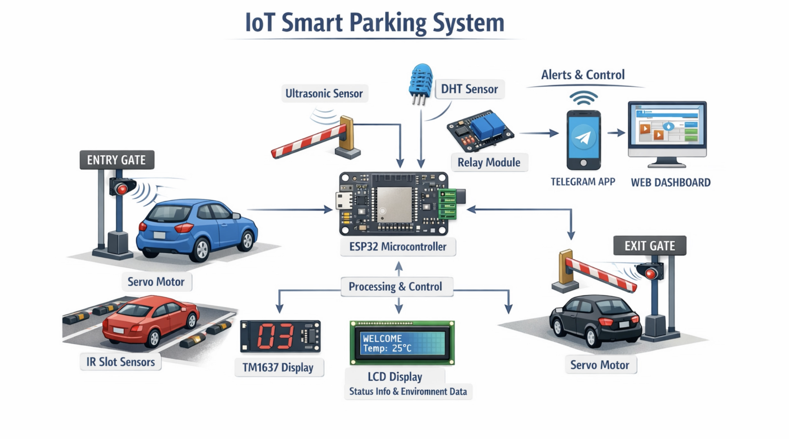
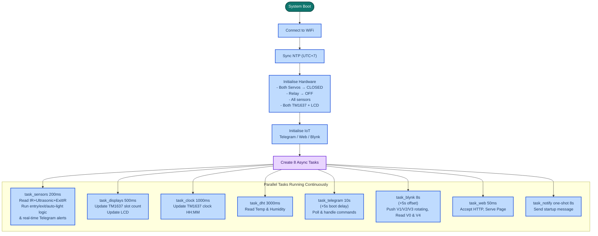
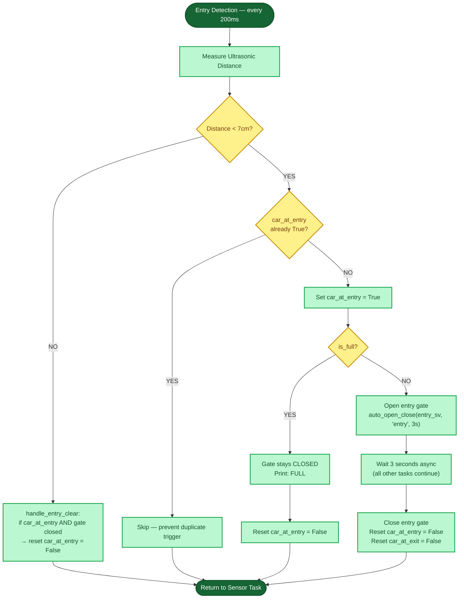
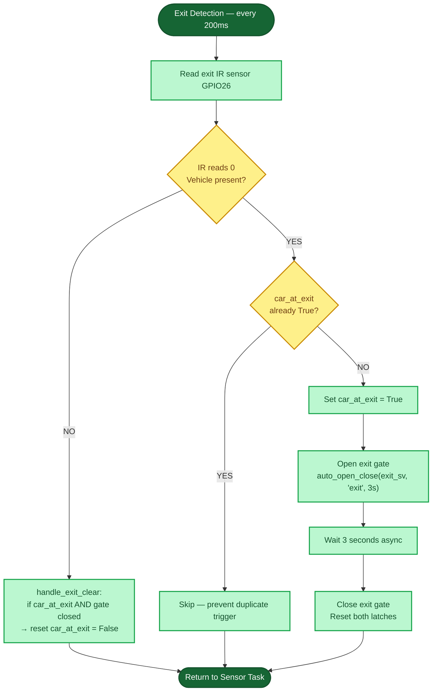
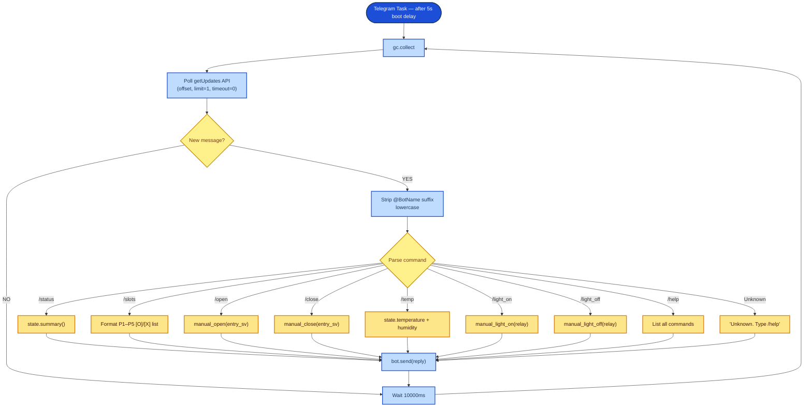
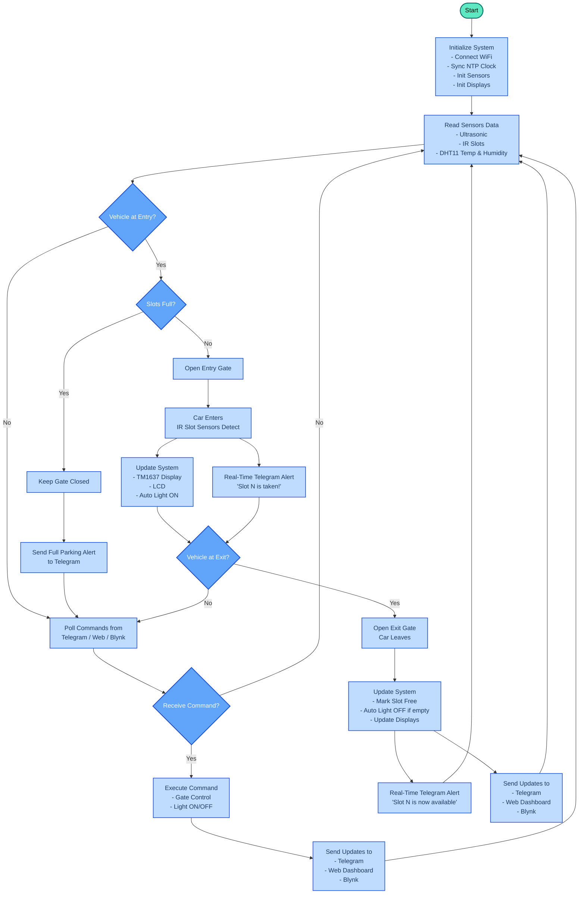

# Smart IoT Parking Management System

### MicroPython on ESP32 — Project Report

---

|                     |                       |
| ------------------- | --------------------- |
| **Course**          | Introduction to IoT   |
| **Group**           | Group 10              |
| **Member 1**        | KEAN Youhorng         |
| **Member 2**        | HOEUN Visai           |
| **Member 3**        | CHHEOURN Sovorthanak  |
| **Member 4**        | EK Panhawath          |

---

## Table of Contents

1. [Introduction](#1-introduction)
2. [Hardware Description](#2-hardware-description)
3. [System Architecture](#3-system-architecture)
4. [Software Architecture](#4-software-architecture)
5. [IoT Integration](#5-iot-integration)
6. [Working Process Explanation](#6-working-process-explanation)
7. [System Logic & Smart Features](#7-system-logic--smart-features)
8. [Challenges Faced](#8-challenges-faced)
9. [Future Improvements](#9-future-improvements)

---

## 1. Introduction

### 1.1 Project Overview

This report documents the design, development, and implementation of a Smart IoT Parking Management System built on the ESP32 microcontroller using MicroPython. The system provides intelligent, real-time management of a five-slot parking facility through automated vehicle detection, dual-gate control (separate entry and exit gates), slot monitoring, environmental sensing, NTP-synchronised clock display, and remote access via three IoT platforms: Telegram, a web dashboard, and Blynk.

The system was developed as a group mini-project to demonstrate the integration of embedded hardware with cloud-based IoT services. All logic runs directly on the ESP32 with no external server; six code files implement the complete system in a flat, single-directory layout.

### 1.2 Problem Statement

Traditional parking facilities rely on manual management, leading to inefficiencies such as vehicles entering full lots, wasted time searching for free spaces, and lack of real-time visibility for facility operators. A smart, automated system addresses all of these issues by integrating sensor-based detection with real-time remote monitoring and control — eliminating the need for a human attendant and providing instant status updates to operators from anywhere.

### 1.3 Objectives

- Automatically detect incoming vehicles at the entry zone and control the entry gate based on slot availability
- Detect departing vehicles at the exit zone and automatically open the exit gate
- Monitor individual parking slot occupancy in real time using IR sensors
- Display live slot availability on a TM1637 7-segment display and show NTP-synchronised time on a second TM1637 clock display
- Show contextual slot-status and gate-status information on a 16×2 LCD
- Monitor environmental conditions (temperature and humidity) using DHT11
- Enable remote monitoring and manual control via Telegram Bot commands
- Provide a live web dashboard (with real-time clock) served directly from the ESP32
- Integrate with Blynk cloud for widget-based remote gate control and sensor data display
- Implement automatic lighting control — lights turn ON when any slot is occupied, OFF when all slots are free

### 1.4 Scope

The system is implemented as a physical prototype using a five-slot parking model. All software is written in MicroPython and runs entirely on the ESP32 without external servers. IoT communication uses the ESP32's built-in WiFi module. Time is synchronised once at boot via NTP (UTC+7 offset) and maintained locally using `utime.ticks_ms()` for the remainder of uptime.

---

## 2. Hardware Description

### 2.1 Components Overview

| Component              | Model             | Pin(s)                       | Role                              |
| ---------------------- | ----------------- | ---------------------------- | --------------------------------- |
| ESP32                  | ESP32 DevKit      | —                            | Main microcontroller              |
| Ultrasonic Sensor      | HC-SR04           | D5 (TRIG), D18 (ECHO)        | Vehicle entry detection           |
| IR Sensor × 5          | FC-51 / Generic   | D34, D32, D35, D25, D33      | Slot occupancy per bay            |
| IR Sensor (exit)       | FC-51 / Generic   | D26                          | Vehicle exit detection            |
| Servo Motor (entry)    | SG90              | D13 (PWM)                    | Entry gate barrier control        |
| Servo Motor (exit)     | SG90              | D12 (PWM)                    | Exit gate barrier control         |
| DHT11                  | DHT11             | D4                           | Temperature & humidity            |
| Relay Module           | 1-Channel Relay   | D2                           | Parking light control             |
| TM1637 (slot display)  | 4-Digit 7-Segment | D14 (CLK), D27 (DIO)         | Available slot counter            |
| TM1637 (clock display) | 4-Digit 7-Segment | D19 (CLK), D23 (DIO)         | NTP-synced HH:MM clock            |
| LCD I2C                | 16×2 PCF8574      | D21 (SDA), D22 (SCL)         | Slot status & gate status display |

### 2.2 ESP32 DevKit

The ESP32 is a dual-core 32-bit microcontroller running at up to 240 MHz with 520 KB SRAM. It features built-in WiFi (802.11 b/g/n) and Bluetooth, making it ideal for IoT applications. MicroPython is flashed onto the ESP32 as the runtime firmware, providing a Python-based development environment with hardware abstraction libraries.

> **Note on input-only pins:** GPIO 34, 35, 32, and 33 are input-only pins on the ESP32 — they cannot be used as outputs. This makes them ideal for IR sensors which only need to be read.

> **Note on boot-sensitive pin:** GPIO 12 is used for the exit servo. Care must be taken as GPIO 12 affects the flash voltage on boot. The servo is powered from an external 5 V supply (not the ESP32 VIN) to avoid brownout.

### 2.3 HC-SR04 Ultrasonic Sensor

The HC-SR04 measures distance using ultrasonic pulses. A 10-microsecond trigger pulse causes the sensor to emit eight 40 kHz pulses and measure the echo return time. Distance is calculated as:

```
Distance (cm) = (echo duration in µs × 0.034) / 2
```

In this system, a detection threshold of **7 cm** is used to trigger vehicle entry logic. A timeout of 30 ms returns 999 cm to indicate no object detected.

### 2.4 IR Sensors (× 5 slot + 1 exit)

Six infrared obstacle sensors are used — five for slot occupancy and one for exit detection.

**Slot sensors (IR\_INVERT = False):** When a vehicle parks over the sensor, the output reads **LOW (0)**, indicating the slot is **OCCUPIED**. When no car is present, the output is **HIGH (1)**, indicating the slot is **FREE**.

| Slot | GPIO Pin |
| ---- | -------- |
| P1   | D34      |
| P2   | D32      |
| P3   | D35      |
| P4   | D25      |
| P5   | D33      |

**Exit sensor (EXIT\_IR\_INVERT = False):** Mounted at the exit lane. When a departing vehicle breaks the beam (reads 0), the exit gate opens automatically. When the beam is clear (reads 1), the exit gate closes.

### 2.5 SG90 Servo Motors (× 2)

Two SG90 micro servo motors are used — one for the entry gate (GPIO 13) and one for the exit gate (GPIO 12). Both are controlled at 50 Hz PWM:

- **0°** = gate closed (barrier lowered)
- **90°** = gate open (barrier raised)

PWM duty cycle is calculated as:

```
duty = int(26 + (angle / 180) × (128 − 26))
```

After sending the position command, a 50 ms settling delay is applied and then PWM duty is set to `0` to prevent servo jitter and reduce power consumption.

Both servos are powered from an **external 5 V supply** (not ESP32 VIN) to prevent brownout during simultaneous gate movement.

### 2.6 DHT11 Sensor

The DHT11 measures ambient temperature (0–50°C, ±2°C) and relative humidity (20–80%, ±5%). It communicates over a single-wire protocol via MicroPython's `dht` library. The system reads every **3000 ms** (`T_DHT`). On read failure, MicroPython raises an `OSError` which is caught and the last valid values are retained.

### 2.7 Relay Module

A single-channel relay module controls the parking lot lights. The relay is **active-low** — pin driven LOW turns the lights ON. The system supports both manual control (Telegram, web, Blynk) and automatic control: lights turn ON when **any** slot becomes occupied and OFF when **all** slots are free.

### 2.8 TM1637 Displays (× 2)

**Slot display (CLK: D14, DIO: D27):** Shows the number of available parking slots as a right-justified number. When the lot is full (`available == 0`), displays **FULL** using custom segment encoding (`F=0x71, U=0x3E, L=0x38, L=0x38`).

**Clock display (CLK: D19, DIO: D23):** Shows the current local time in HH:MM format, synchronised to NTP on boot (UTC+7). The colon between hours and minutes blinks every second. Updated by a dedicated `task_clock` every 1000 ms.

### 2.9 16×2 LCD with I2C Backpack

A standard 16×2 character LCD with a PCF8574 I2C backpack connects on GPIO 21 (SDA) and GPIO 22 (SCL). The display shows:

- **Line 1:** Individual slot status grid, e.g. `1E 2F 3E 4E 5E` where `E` = Empty (free) and `F` = Full (occupied)
- **Line 2:** Gate status and contextual event — `G:O Car In`, `G:C Parking Full`, `G:C Free Slot: 3`, or `G:C Car Out`

> **Tip:** If the display is blank, the I2C address may be `0x3F` instead of the default `0x27`. Change `LCD_ADDR` in `config.py`.

---

## 3. System Architecture

### 3.1 Flat Single-File Architecture

The entire system is implemented in **six MicroPython files** uploaded directly to the ESP32 root. There are no subdirectories. Each file has a single responsibility:

| File          | Responsibility                                              |
| ------------- | ----------------------------------------------------------- |
| `config.py`   | All pins, credentials, thresholds, and timing constants     |
| `state.py`    | Shared system state (`ParkingState` class + singleton)      |
| `hardware.py` | All hardware drivers (sensors, servos, relay, displays, NTP)|
| `logic.py`    | All decision logic (gate control, auto-light, entry/exit)   |
| `iot.py`      | Telegram Bot, Web Server, Blynk (all IoT in one file)       |
| `main.py`     | WiFi, NTP sync, hardware init, task creation, event loop    |

### 3.2 Shared State Architecture

The most critical architectural decision is the use of a **single shared state object** (`state.py`). All modules — hardware, logic, and IoT — read from and write to this one object. This eliminates direct coupling between modules.

```
Hardware (hardware.py)  →  write sensor data    →  state.slots[], state.temperature
Logic (logic.py)        →  reads state, decides →  state.gate_open, state.light_on
IoT (iot.py)            →  reads state to serve →  Telegram, Web, Blynk responses
                        →  calls logic functions →  on command from any platform
```

**State variables:**

| Variable       | Type     | Description                                          |
| -------------- | -------- | ---------------------------------------------------- |
| `slots[0..4]`  | `bool[]` | `True` = slot occupied, `False` = slot free          |
| `gate_open`    | `bool`   | `True` = entry gate is currently open                |
| `light_on`     | `bool`   | `True` = parking lights are currently ON             |
| `temperature`  | `float`  | Latest DHT11 temperature reading in °C               |
| `humidity`     | `float`  | Latest DHT11 humidity reading in %                   |
| `car_at_entry` | `bool`   | `True` = vehicle currently detected at entry zone    |
| `car_at_exit`  | `bool`   | `True` = vehicle currently detected at exit zone     |

**Helper properties and methods:**

- `state.available` — count of free slots
- `state.is_full` — `True` when all slots occupied
- `state.is_occupied` — `True` when at least one slot is occupied
- `state.summary()` — formatted string for Telegram `/status`
- `state.lcd_lines()` — two 16-character strings for the LCD

### 3.3 Asynchronous Task Architecture

The system uses MicroPython's `uasyncio` library to run **eight concurrent tasks**. Each task operates on an independent polling interval and yields control using `await asyncio.sleep_ms()`.

| Task            | Interval            | Description                                                       |
| --------------- | ------------------- | ----------------------------------------------------------------- |
| `task_sensors`  | 200 ms              | Reads IR slots + ultrasonic + exit IR; runs entry/exit/auto-light logic |
| `task_displays` | 500 ms              | Updates TM1637 slot counter and LCD status                        |
| `task_clock`    | 1000 ms             | Updates TM1637 clock display with current HH:MM                   |
| `task_dht`      | 3000 ms             | Reads DHT11 temperature and humidity                              |
| `task_telegram` | 10 000 ms (+ 5 s boot delay) | Polls Telegram API for new commands                     |
| `task_blynk`    | 8000 ms (+ 5 s offset) | Syncs data to Blynk, reads gate button                         |
| `task_web`      | 50 ms               | Accepts and responds to HTTP connections                          |
| `task_notify`   | one-shot (8 s delay)| Sends startup notification with IP and slot count via Telegram    |

> **Key design decision:** Telegram polling begins after a 5-second boot delay (`task_telegram` starts with `await asyncio.sleep_ms(5000)`). Blynk starts after an additional 5-second offset (`T_BLYNK_OFF = 5000 ms`). This staggers the two heaviest HTTP tasks so they never fire simultaneously on first boot.

### 3.4 System Architecture Diagram

The diagram below provides a physical overview of all components and their connections in the IoT Smart Parking System.



The detailed software-layer architecture — showing GPIO pin assignments, async task breakdown, and cloud platform interactions — is shown in the mermaid diagram below.

```mermaid
graph TB
    classDef sensor fill:#dbeafe,stroke:#1d4ed8,stroke-width:2px,color:#1e3a5f
    classDef actuator fill:#fce7f3,stroke:#9d174d,stroke-width:2px,color:#500724
    classDef display fill:#d1fae5,stroke:#065f46,stroke-width:2px,color:#064e3b
    classDef esp32 fill:#fef3c7,stroke:#b45309,stroke-width:3px,color:#451a03
    classDef cloud fill:#ede9fe,stroke:#5b21b6,stroke-width:2px,color:#2e1065

    subgraph HARDWARE_LAYER [Hardware Layer - Sensors & Actuators]
        direction TB
        subgraph SENSORS [Sensors]
            direction LR
            US[("Ultrasonic HC-SR04<br/>TRIG: GPIO5<br/>ECHO: GPIO18")]:::sensor
            DHT[("DHT11<br/>Temp & Humidity<br/>DATA: GPIO4")]:::sensor
            EXITIR[("Exit IR Sensor<br/>GPIO26")]:::sensor
            subgraph IR_SENSORS [IR Sensors - Parking Slots]
                direction LR
                IR1[("IR1 Slot P1<br/>GPIO34")]:::sensor
                IR2[("IR2 Slot P2<br/>GPIO32")]:::sensor
                IR3[("IR3 Slot P3<br/>GPIO35")]:::sensor
                IR4[("IR4 Slot P4<br/>GPIO25")]:::sensor
                IR5[("IR5 Slot P5<br/>GPIO33")]:::sensor
            end
        end
        subgraph ACTUATORS [Actuators]
            direction LR
            SERVO_E[("Entry Servo SG90<br/>Gate Control<br/>PWM: GPIO13")]:::actuator
            SERVO_X[("Exit Servo SG90<br/>Gate Control<br/>PWM: GPIO12")]:::actuator
            RELAY[("Relay Module<br/>Parking Lights<br/>CONTROL: GPIO2")]:::actuator
        end
        subgraph DISPLAYS [Displays]
            direction LR
            TM_SLOT[("TM1637 Slot Display<br/>Available Slots<br/>CLK: GPIO14 / DIO: GPIO27")]:::display
            TM_CLK[("TM1637 Clock Display<br/>HH:MM NTP UTC+7<br/>CLK: GPIO19 / DIO: GPIO23")]:::display
            LCD[("16x2 LCD I2C<br/>Slot Grid & Gate Status<br/>SDA: GPIO21 / SCL: GPIO22")]:::display
        end
    end

    subgraph ESP32_LAYER [ESP32 Core Layer - MicroPython Controller]
        ESP32[("ESP32<br/>MicroPython<br/>Dual-Core 240MHz")]:::esp32
        subgraph ESP32_FUNCTIONS [8 Async Tasks]
            direction LR
            SENSORS_T[("task_sensors 200ms<br/>task_displays 500ms<br/>task_clock 1000ms<br/>task_dht 3000ms")]
            IOT_T[("task_telegram 10s<br/>task_blynk 8s<br/>task_web 50ms<br/>task_notify one-shot")]
        end
        ESP32 --- SENSORS_T
        ESP32 --- IOT_T
    end

    subgraph CLOUD_LAYER [IoT/Cloud Layer - Platforms]
        direction LR
        subgraph BLYNK [Blynk Cloud]
            BLYNK_API[("Blynk HTTP REST API")]
            BLYNK_DASH[("Mobile Dashboard<br/>V0: Entry Gate Button<br/>V1: Temp Gauge<br/>V2: Slots Display<br/>V3: Humidity Gauge<br/>V4: Exit Gate Button")]
            BLYNK_API --- BLYNK_DASH
        end
        subgraph WEB [Web Dashboard - ESP32 Hosted]
            WEB_HTML[("HTML/CSS Dashboard<br/>with Live Clock<br/>Entry & Exit Gate Controls")]
            WEB_API[("HTTP Server Port 80")]
            WEB_HTML --- WEB_API
        end
        subgraph TELEGRAM [Telegram Bot]
            TELEGRAM_BOT[("Telegram Bot API")]
            TELEGRAM_CMD[("Commands:<br/>/status /slots /open /close<br/>/temp /light_on /light_off /help")]
            TELEGRAM_BOT --- TELEGRAM_CMD
        end
    end

    US -- "distance (cm)" --> ESP32
    DHT -- "temp & humidity" --> ESP32
    EXITIR -- "exit detect (0/1)" --> ESP32
    IR1 -- "slot status (0/1)" --> ESP32
    IR2 -- "slot status (0/1)" --> ESP32
    IR3 -- "slot status (0/1)" --> ESP32
    IR4 -- "slot status (0/1)" --> ESP32
    IR5 -- "slot status (0/1)" --> ESP32

    ESP32 -- "PWM 0-90°" --> SERVO_E
    ESP32 -- "PWM 0-90°" --> SERVO_X
    ESP32 -- "ON/OFF" --> RELAY
    ESP32 -- "bit-bang slot count / FULL" --> TM_SLOT
    ESP32 -- "bit-bang HH:MM" --> TM_CLK
    ESP32 -- "I2C slot grid + status" --> LCD

    ESP32 ==> WIFI([WiFi 2.4GHz])
    WIFI ==> CLOUD_LAYER

    ESP32 <-- "HTTP GET/SET gate cmd" --> BLYNK
    ESP32 <-- "HTTP GET/POST HTML & JSON" --> WEB
    ESP32 <-- "HTTP polling getUpdates & sendMessage" --> TELEGRAM

    style HARDWARE_LAYER fill:#f8f9fa,stroke:#333,stroke-width:2px,stroke-dasharray: 5 5
    style ESP32_LAYER fill:#f8f9fa,stroke:#333,stroke-width:2px,stroke-dasharray: 5 5
    style CLOUD_LAYER fill:#f8f9fa,stroke:#333,stroke-width:2px,stroke-dasharray: 5 5
    style SENSORS fill:#ffffff,stroke:#999,stroke-width:1px
    style ACTUATORS fill:#ffffff,stroke:#999,stroke-width:1px
    style DISPLAYS fill:#ffffff,stroke:#999,stroke-width:1px
    style IR_SENSORS fill:#ffffff,stroke:#666,stroke-width:1px,stroke-dasharray: 3 3
    style ESP32_FUNCTIONS fill:#ffffff,stroke:#999,stroke-width:1px
    style BLYNK fill:#ffffff,stroke:#999,stroke-width:1px
    style WEB fill:#ffffff,stroke:#999,stroke-width:1px
    style TELEGRAM fill:#ffffff,stroke:#999,stroke-width:1px
```



---

## 4. Software Architecture

### 4.1 Project File Structure

All six files are uploaded to the ESP32 root directory (flat layout — no subdirectories):

```
/  (ESP32 root)
├── config.py     # All pins, credentials, thresholds, task intervals
├── state.py      # ParkingState class + singleton instance
├── hardware.py   # Ultrasonic, IRSensor, Servo, Relay, DHTSensor,
│                 # TM1637, LCD, NTP clock (sync_ntp, get_hms, get_time_str)
├── logic.py      # Entry/exit detection, gate control, auto-light logic
├── iot.py        # TelegramBot, WebServer, Blynk (all IoT in one file)
└── main.py       # WiFi, boot sequence, task creation, async event loop
```

### 4.2 File Descriptions

| File          | Purpose                                                                         |
| ------------- | ------------------------------------------------------------------------------- |
| `config.py`   | Every pin number, credential, threshold, and timing constant in one place       |
| `state.py`    | Single shared `ParkingState` object: slots, gate, lights, temp, humidity, latches |
| `hardware.py` | All hardware classes + NTP clock helpers; renamed from `dht.py` to avoid name conflict with MicroPython's `dht` module |
| `logic.py`    | Entry/exit gate handlers, auto-open-close coroutine, auto-light check, manual command functions |
| `iot.py`      | `TelegramBot` (8 commands), `WebServer` (non-blocking, dark-themed HTML + clock + exit gate controls), `Blynk` (V1/V2/V3 rotating push + V0 & V4 gate reads) |
| `main.py`     | WiFi connection, NTP sync, hardware + IoT instantiation, 8 async task creation  |

### 4.3 Design Principles

**Single Responsibility**
Each file has exactly one job. Hardware drivers only read/write hardware. The logic module only makes decisions. IoT modules only communicate with external platforms.

**Centralised Configuration**
Every pin number, credential, threshold value, and timing constant is defined in `config.py`. No hardcoded values appear anywhere else. Changing a pin or credential requires editing only one file.

**Non-Blocking Async**
All tasks use `await asyncio.sleep_ms()` to yield control. No task blocks the CPU for more than a few milliseconds, keeping sensor reads and gate responses responsive.

**Error Isolation**
Every IoT task wraps network calls in `try/except` blocks. A failed Telegram request or dropped WiFi connection does not crash the sensor or gate loop. Hardware continues functioning even if cloud platforms are unreachable. Every task calls `gc.collect()` before and after HTTP operations to prevent memory fragmentation.

**State-Change Detection**
The Blynk entry gate button only triggers the servo when V0 value *changes* (tracked via `_last_v0`). The exit gate button V4 is similarly tracked via `_last_v4`. Auto-light only changes relay state on occupancy state transitions, not on every 200 ms tick.

---

## 5. IoT Integration

### 5.1 Telegram Bot

The Telegram Bot is implemented using the Telegram Bot API's HTTP polling method. The ESP32 waits 5 seconds after boot, then polls the `getUpdates` endpoint every **10 000 ms** (`T_TELEGRAM`). Commands are parsed case-insensitively after stripping the `@BotName` suffix.

| Command       | Response                                                                          |
| ------------- | --------------------------------------------------------------------------------- |
| `/status`     | Full system summary: slot count, gate status, light status, temperature, humidity |
| `/slots`      | Individual status of each slot (P1–P5) showing FREE or OCCUPIED with `[O]`/`[X]` prefix |
| `/open`       | Manually opens entry gate and confirms                                            |
| `/close`      | Manually closes entry gate and confirms                                           |
| `/temp`       | Returns current temperature (°C) and humidity (%)                                |
| `/light_on`   | Activates relay to turn parking lights ON                                         |
| `/light_off`  | Deactivates relay to turn parking lights OFF                                      |
| `/help`       | Lists all available commands                                                      |

A startup notification is sent **8 seconds after boot** (via `task_notify`) including the ESP32's local IP address, current time (UTC+7), and available slot count.

**Setup steps:**

1. Create a bot via `@BotFather` on Telegram and copy the token
2. Get your Chat ID via `@userinfobot`
3. Paste both into `config.py` as `BOT_TOKEN` and `CHAT_ID`

### 5.2 Web Server Dashboard

The ESP32 runs a lightweight HTTP server on port 80 using MicroPython's `socket` library in non-blocking mode (`setblocking(False)`). When a client connects, the server reads the HTTP request, checks for a command parameter (`cmd=open`, `cmd=close`, `cmd=openx`, `cmd=closex`, `cmd=lon`, `cmd=loff`), executes any command via `logic.py`, then serves a dynamically generated HTML page.

**Dashboard features:**

- Colour-coded slot cards — green (`#14532d`) for FREE, red (`#7f1d1d`) for OCCUPIED
- Live display of available slots (free/total), gate status, light status, temperature, humidity
- **Live NTP-synchronised clock** displayed in HH:MM:SS UTC+7 format
- Auto-refresh every 3 seconds via `<meta http-equiv="refresh" content="3">`
- Six manual control buttons: Open Gate, Close Gate, Open Exit, Close Exit, Light ON, Light OFF
- Responsive dark-themed UI (`background: #0f172a`) that works on desktop and mobile

**Access:** Open `http://<ESP32-IP-address>` in any browser on the same network. The IP address is shown on the LCD at boot and sent via Telegram.

### 5.3 Blynk Integration

The Blynk integration uses the **Blynk HTTP API** (`blynk.cloud/external/api`) with no additional libraries. All communication is transparent HTTP GET requests.

| Virtual Pin | Direction    | Widget        | Data                                        |
| ----------- | ------------ | ------------- | ------------------------------------------- |
| V0          | ESP32 reads  | Switch/Button | Entry gate control: `1` = open, `0` = close |
| V1          | ESP32 writes | Gauge         | Temperature in °C                           |
| V2          | ESP32 writes | Value Display | Available slot count (0–5)                  |
| V3          | ESP32 writes | Gauge         | Humidity in %                               |
| V4          | ESP32 reads  | Switch/Button | Exit gate control: `1` = open, `0` = close  |

> **Note:** To conserve memory and reduce HTTP load, V1 (temperature), V2 (slot count), and V3 (humidity) are **pushed in a rotating 3-step cycle** rather than every sync. Step 0 pushes V1, step 1 pushes V2, step 2 pushes V3, step 3 is read-only. This is controlled by an internal `_step` counter.

**Data flow:**

1. Every 8000 ms, the ESP32 rotates through V1 (temperature) → V2 (slot count) → V3 (humidity) in a 3-step push cycle
2. On every cycle, the ESP32 reads V0 to check if the entry gate button state has changed (using `_last_v0` tracking)
3. If V0 changed to `1`, the entry gate opens; if changed to `0`, the entry gate closes
4. The ESP32 also reads V4 to check if the exit gate button state has changed (using `_last_v4` tracking)
5. If V4 changed to `1`, the exit gate opens; if changed to `0`, the exit gate closes
6. Blynk's web dashboard displays widget values in real time

**Setup steps:**

1. Create a Template at `blynk.cloud` with hardware = ESP32
2. Add five datastreams: V0 (Integer, 0–1), V1 (Double, 0–50), V2 (Integer, 0–5), V3 (Double, 0–100), V4 (Integer, 0–1)
3. Build the web dashboard with Switch (V0 — entry gate), Gauge (V1 — temp), Value Display (V2 — slots), Gauge (V3 — humidity), Switch (V4 — exit gate)
4. Create a device from the template and copy the token into `config.py` as `BLYNK_TOKEN`

---

## 6. Working Process Explanation

### 6.1 System Boot Sequence

```
Power ON
  │
  ├── MicroPython loads main.py
  ├── gc.enable() + gc.collect()
  ├── connect_wifi() — retry 20 s, machine.reset() on failure
  ├── sync_ntp() — NTP UTC+7, falls back to epoch offset on failure
  ├── Initialise hardware
  │     ├── Entry Servo (GPIO13) → CLOSED position
  │     ├── Exit  Servo (GPIO12) → CLOSED position
  │     ├── Relay (GPIO2)  → OFF
  │     ├── IRSensor (5 slot pins) → read initial state
  │     ├── Exit IR (GPIO26)
  │     ├── Ultrasonic (GPIO5/18)
  │     ├── DHT11 (GPIO4)
  │     ├── TM1637 slot display (GPIO14/27)
  │     ├── TM1637 clock display (GPIO19/23)
  │     └── LCD → show "Smart Parking / Booting..." then IP address
  ├── Initialise IoT
  │     ├── TelegramBot (token, chat_id, entry_servo, relay)
  │     ├── WebServer (port 80, non-blocking)
  │     └── Blynk (token, entry_servo, exit_servo)
  └── Create 8 async tasks → event loop begins
        ├── task_sensors, task_displays, task_clock, task_dht
        ├── task_telegram (+5s delay), task_blynk (+5s offset)
        ├── task_web, task_notify (+8s one-shot)
```

### 6.2 Main System Flow



### 6.3 Vehicle Entry Flow

The `task_sensors` runs every 200 ms. The entry detection logic uses the `car_at_entry` latch to prevent repeated triggering for the same vehicle.



### 6.4 Vehicle Exit Flow

The exit IR sensor on GPIO 26 is read by `task_sensors` on every 200 ms cycle. It uses the same latch pattern as entry.



### 6.5 Telegram Command Flow



### 6.6 Slot Monitoring & Display Flow

```
Every 200 ms (task_sensors):
  slot_ir.update(state) reads GPIO34, 32, 35, 25, 33
    → state.slots[0..4] = True if IR reads 0 (car present), False if 1 (free)
  auto_light_check(relay):
    → if state.is_occupied and NOT state.light_on → relay.on(), state.light_on = True
    → if NOT state.is_occupied and state.light_on  → relay.off(), state.light_on = False

Every 500 ms (task_displays):
  tm.show(state.available)  → TM1637 slot display: number or "FULL"
  lcd.update(state)         → LCD line 1: "1E 2F 3E 4E 5E"
                            → LCD line 2: "G:C Car In" / "G:O Parking Full" etc.

Every 1000 ms (task_clock):
  h,m,s = get_hms()        → tmc.show_clock(h, m, colon=s%2==0)
                            → TM1637 clock: blinking HH:MM
```

### 6.7 Remote Command Flow

The same `logic.py` functions are called identically whether the command comes from Telegram, the web dashboard, or Blynk — ensuring consistent behaviour regardless of control source.

```
User sends /open via Telegram
  │
  └── bot.poll() receives update
        └── _cmd("/open")
              └── manual_open(entry_sv)        ← logic.py
                    ├── entry_sv.open()        ← Servo.open() in hardware.py
                    ├── state.gate_open = True
                    └── bot.send("Entry gate opened.")

User clicks "Open Gate" on Web Dashboard
  │
  └── HTTP GET /?cmd=open
        └── webserver.handle(req)
              └── manual_open(entry_sv)        ← same logic.py function

User clicks "Open Exit" on Web Dashboard
  │
  └── HTTP GET /?cmd=openx
        └── webserver.handle(req)
              └── manual_open(exit_sv)         ← same logic.py function

User presses Entry Gate button on Blynk (V0 → "1")
  │
  └── blynk.sync() reads V0, sees change from last value
        └── manual_open(entry_sv)              ← same logic.py function

User presses Exit Gate button on Blynk (V4 → "1")
  │
  └── blynk.sync() reads V4, sees change from last value
        └── manual_open(exit_sv)              ← same logic.py function
```

### 6.8 Environmental Monitoring Flow

```
Every 3000 ms (task_dht):
  dht_sensor.read()
    → state.temperature = float °C
    → state.humidity    = float %
  On OSError: last cached values retained

Values are then used by:
  ├── task_displays  → LCD line 2 (contextual, does not show temp)
  ├── task_telegram  → /temp and /status responses
  ├── task_blynk     → rotated to V1 (temp) / V2 (slots) / V3 (humidity) across a 3-step cycle
  └── task_web       → shown in Environment card on dashboard
```

---

### 6.9 Complete System Logic Flow (Car Entry → Parking → Exit)

The diagram below shows the full journey of a vehicle — from arriving at the entry gate, through parking, all the way to leaving through the exit gate. All hardware, displays, and IoT platforms are shown together.



**How to read this diagram:**

- **Blue nodes** — hardware reads/writes (sensors, servos, relay)
- **Indigo nodes** — shared state (`ParkingState`) updates
- **Green nodes** — display outputs (TM1637 × 2, LCD)
- **Purple nodes** — IoT platform interactions (Telegram, Web, Blynk)
- **Pink nodes** — decision logic in `logic.py`
- **Yellow diamonds** — branch decisions
- The **IoT monitoring loop** (middle section) runs continuously in parallel via async tasks while the car is parked — it does not block or wait for entry/exit events

---

## 7. System Logic & Smart Features

### 7.1 Shared State Logic

The entire system revolves around a single `ParkingState` instance defined in `state.py` and imported everywhere as `from state import state`. This object is the **single source of truth** — every module reads from it and writes to it, but no module communicates directly with another module.

### 7.2 Vehicle Entry Detection Logic

The ultrasonic sensor is read every 200 ms. A threshold of **7 cm** triggers entry logic:

```
distance < 7cm AND car_at_entry == False
        │
        ├── is_full == True  →  Gate stays CLOSED (car_at_entry reset to False immediately)
        │
        └── is_full == False →  car_at_entry = True
                                 asyncio.create_task(auto_open_close(entry_sv, "entry", 3))
                                 → Opens gate, waits 3 s, closes gate, resets latches
```

When distance ≥ 7 cm and the gate is closed, `handle_entry_clear()` resets `car_at_entry` if it was set without triggering a gate open.

### 7.3 Vehicle Exit Detection Logic

The exit IR sensor (GPIO 26) is read every 200 ms. When it reads 0 (vehicle present at exit lane):

```
exit_ir reads 0 AND car_at_exit == False
        │
        └── car_at_exit = True
             asyncio.create_task(auto_open_close(exit_sv, "exit", 3))
             → Opens exit gate, waits 3 s, closes exit gate, resets both latches
```

The exit gate always opens regardless of slot count — a departing vehicle is always allowed to leave.

### 7.4 Gate Control Logic

| Position | Angle | Duty Cycle |
| -------- | ----- | ---------- |
| Closed   | 0°    | ~26        |
| Open     | 90°   | ~77        |

**Automatic entry/exit:** `auto_open_close()` is an async coroutine — opens the gate, waits `GATE_AUTO_CLOSE` seconds (default **3 s**, configurable in `config.py`), then closes automatically. All other tasks continue normally during the wait.

**Manual control:** All three platforms call the same `manual_open()` / `manual_close()` functions in `logic.py`, ensuring identical behaviour.

**Jitter prevention:** After a 50 ms settling time, PWM duty is set to `0`, eliminating servo oscillation and reducing power consumption.

### 7.5 Slot Occupancy Logic

```
IR sensor value == 0  (invert=False)  →  beam blocked by car  →  OCCUPIED  →  state.slots[i] = True
IR sensor value == 1  (invert=False)  →  beam clear           →  FREE      →  state.slots[i] = False
```

Derived values computed on the fly as properties:

```python
state.available   =  state.slots.count(False)   # free slots
state.is_full     =  state.available == 0        # all 5 occupied
state.is_occupied =  state.slots.count(True) > 0 # at least 1 occupied
```

### 7.6 Automatic Lighting Logic

Lights are controlled based on **any** occupancy (not only when the lot is completely full):

```
IF state.is_occupied == True  AND  state.light_on == False
    → relay.on()  →  state.light_on = True     (lights ON when any car parks)

IF state.is_occupied == False  AND  state.light_on == True
    → relay.off()  →  state.light_on = False   (lights OFF when lot is empty)
```

The `AND state.light_on == False` / `AND state.light_on == True` guards prevent the relay from toggling on every 200 ms cycle — it only acts on state *changes*, protecting relay contacts from excessive switching.

### 7.7 NTP Clock Logic

On boot, `sync_ntp()` calls MicroPython's `ntptime.settime()` to set the RTC. The UTC+7 offset is applied by adding `7 × 3600` seconds. A base epoch and base tick counter are stored; subsequent time reads use `utime.ticks_diff()` to compute elapsed seconds without re-querying NTP. If NTP fails, the system falls back to `epoch = 7 × 3600` (midnight) and continues running.

### 7.8 Task Scheduling Logic

Staggered start offsets prevent heavy HTTP tasks from colliding:

| Time after boot | Event                                     |
| --------------- | ----------------------------------------- |
| 0 ms            | Sensors, Displays, Clock, Web tasks start |
| ~100 ms         | Main loop gc.collect every 100ms          |
| 5 000 ms        | Telegram task begins first poll           |
| 5 000 ms        | Blynk offset `T_BLYNK_OFF` starts         |
| 8 000 ms        | `task_notify` sends startup Telegram msg  |
| 10 000 ms       | Telegram first poll repeats               |
| 13 000 ms       | Blynk first sync fires                    |

### 7.9 List of Smart Features

| #  | Feature                            | Description                                                                              |
| -- | ---------------------------------- | ---------------------------------------------------------------------------------------- |
| 1  | **Intelligent Entry Gate**         | Entry gate checks slot availability before opening — stays closed if lot is full         |
| 2  | **Always-Open Exit Gate**          | Exit IR instantly opens the exit gate for any departing vehicle, no availability check   |
| 3  | **Auto Gate Close Timer**          | Both gates close automatically after 3 s via async coroutine; no operator needed        |
| 4  | **Dual Latch Prevention**          | `car_at_entry` and `car_at_exit` flags prevent re-triggering for the same vehicle       |
| 5  | **Automatic Lighting (Any-Occ)**   | Lights ON when any slot occupied; OFF only when lot completely empty                     |
| 6  | **Individual Slot Monitoring**     | Each of 5 bays has its own IR sensor — exact slot identity always known                  |
| 7  | **Dual TM1637 Displays**           | One shows available slot count / "FULL"; the other shows live NTP-synced HH:MM clock    |
| 8  | **NTP Time Sync**                  | Time synced to NTP (UTC+7) on boot; clock maintained locally via tick counter            |
| 9  | **Tri-Platform Remote Control**    | Telegram, Web Dashboard, and Blynk all call the same `logic.py` functions               |
| 10 | **Startup Telegram Notification**  | ESP32 sends IP address, time, and slot count via Telegram 8 s after boot                 |
| 10a| **Real-Time Telegram Slot Alerts** | `task_sensors` sends instant Telegram messages on every slot occupancy change ("Slot N is taken!" / "Slot N is now available"), gate events ("Entry/Exit Gate: Open", "Car Entered/Exited!"), and full-lot alerts — using `_last_slots[]` change detection to prevent duplicates |
| 11 | **Live Web Dashboard with Clock**  | Auto-refreshing dashboard with real-time HH:MM:SS display, entry & exit gate controls, served from ESP32 |
| 12 | **Blynk State-Change Detection**   | Entry servo only moves when V0 changes (`_last_v0` tracking); exit servo only moves when V4 changes (`_last_v4` tracking) — neither fires on every sync cycle |
| 13 | **Graceful Network Degradation**   | Hardware operates normally if WiFi or cloud platforms become unreachable                 |
| 14 | **Staggered Task Scheduling**      | Telegram (+5 s) and Blynk (+5 s offset) delayed to prevent concurrent HTTP requests     |
| 15 | **Rotating Blynk Push**            | V1 (temp), V2 (slots), and V3 (humidity) pushed in a rotating 3-step cycle to reduce per-sync HTTP load |
| 16 | **FULL Display on TM1637**         | Shows "FULL" segment pattern instead of `0` — immediately readable by an approaching driver |
| 17 | **Contextual LCD Line 2**          | LCD adapts its second line to show Car In / Car Out / Parking Full / Free Slot count    |
| 18 | **Servo Jitter-Free Operation**    | PWM set to 0 after 50 ms settling — stable gate arm and lower power draw                |
| 19 | **gc.collect() Memory Management** | Garbage collection called before/after every HTTP operation to prevent heap fragmentation|

---

## 8. Challenges Faced

### 8.1 ESP32 Memory Constraints

MicroPython consumes approximately 100 KB of the ESP32's available RAM just for its runtime. With three IoT platforms each making HTTP requests and the web server dynamically generating HTML, memory fragmentation became a concern.

**Solution:** Call `gc.collect()` before and after every HTTP operation (`urequests.get/post`). Close responses immediately with `r.close()`. Use `ujson` instead of `json` for lightweight parsing. Delete large variables (`del data`, `del raw`) after use. Keep all IoT code in one file (`iot.py`) to reduce import overhead.

### 8.2 Concurrent HTTP Requests

Running Telegram polling and Blynk syncing at the same time caused occasional `ENOMEM` failures when both tasks fired simultaneously.

**Solution:** Telegram task starts after a 5-second boot delay. Blynk starts after an additional 5-second offset (`T_BLYNK_OFF = 5000 ms`). With Telegram polling every 10 s and Blynk every 8 s, collisions are rare, and `gc.collect()` on each cycle keeps heap available.

### 8.3 Servo Jitter

The SG90 servos exhibited continuous small oscillations when the PWM signal remained active after reaching the target position.

**Solution:** After a 50 ms settling delay, the PWM duty is set to `0`. This releases the signal line and stops the servo from actively holding position via PWM, eliminating jitter while reducing power consumption.

### 8.4 TM1637 Custom Driver

MicroPython does not include a built-in TM1637 library, requiring a custom bit-bang implementation. The TM1637 uses a non-standard I2C-like protocol with specific timing for start/stop conditions and ACK handling. The system also needed to drive **two** TM1637 displays — one for slot count and one for a blinking HH:MM clock.

**Solution:** Implemented a complete bit-bang driver (`TM1637` class in `hardware.py`) supporting digit encoding for 0–9, custom FULL segments (`0x71, 0x3E, 0x38, 0x38`), a clock mode with blinking colon (`show_clock(h, m, colon)`), and configurable brightness. Both displays are separate instances with different pin pairs.

### 8.5 LCD I2C Address Mismatch

The PCF8574 I2C backpack shipped with the LCD module used address `0x3F` instead of the commonly documented `0x27`. This caused the display to remain completely blank with no error message.

**Solution:** An I2C scanner script was run to identify the correct address. The address is stored as `LCD_ADDR` in `config.py` so it can be easily changed without modifying the driver code.

### 8.6 IR Sensor Logic Inversion

Initial testing revealed that the IR sensors' occupancy logic depended on the specific module variant. Some modules read `0` when the beam is blocked (car present), others read `1`. Hardcoding a single logic direction caused false occupancy readings.

**Solution:** Introduced `IR_INVERT` and `EXIT_IR_INVERT` flags in `config.py`. The `IRSensor` class applies `_occ(v) = (v==1) if invert else (v==0)`, making the occupancy logic easily reversible without touching driver code.

### 8.7 `hardware.py` Naming Conflict

MicroPython's built-in `dht` module name conflicted with a planned `dht.py` hardware driver filename, causing an `ImportError` when the file was named `dht.py`.

**Solution:** All hardware drivers were merged into a single file named `hardware.py`, avoiding the name conflict entirely while also reducing the total number of files uploaded to the ESP32.

### 8.8 IR Sensor Placement

Initial testing showed that IR sensors placed at the front edge of each slot gave unreliable readings from small toy cars.

**Solution:** Sensors were moved to the dead centre of each parking bay and mounted flush with the surface so only the emitter and receiver faces are exposed at floor level.

---

## 9. Future Improvements

### 9.1 MQTT Protocol Integration

Replacing the current HTTP polling architecture with MQTT would significantly reduce network overhead. The ESP32 would publish state changes only when they occur — eliminating the 8–10 s polling cycles for Telegram and Blynk.

### 9.2 License Plate Recognition

Adding an ESP32-CAM module at the entry gate would enable automatic license plate recognition. Registered plates could be allowed or denied entry automatically, and entry/exit events logged with timestamps.

### 9.3 Mobile Application

A dedicated mobile application would provide a better user experience than the current web dashboard — true real-time WebSocket updates, push notifications when the lot becomes full or a space opens up, and slot reservation features.

### 9.4 Multi-Floor Support

The architecture could be extended to support multiple parking floors by adding a floor identifier to each slot in the state object and deploying multiple ESP32 units communicating via MQTT to a central broker.

### 9.5 Payment Integration

A future version could integrate a payment gateway — tracking entry/exit times per slot, calculating fees, and requiring payment (via QR code on LCD or Telegram payment link) before the exit gate opens.

### 9.6 OTA Firmware Updates

Implementing Over-The-Air updates using MicroPython's `webrepl` or a custom HTTP endpoint would allow remote code deployment without physical access — critical for real deployed facilities.

### 9.7 Battery Backup & Power Monitoring

Adding a UPS module with an INA219 current sensor would allow the system to monitor power consumption and continue operating during outages. Deep sleep during low-traffic periods could extend battery runtime.

---
